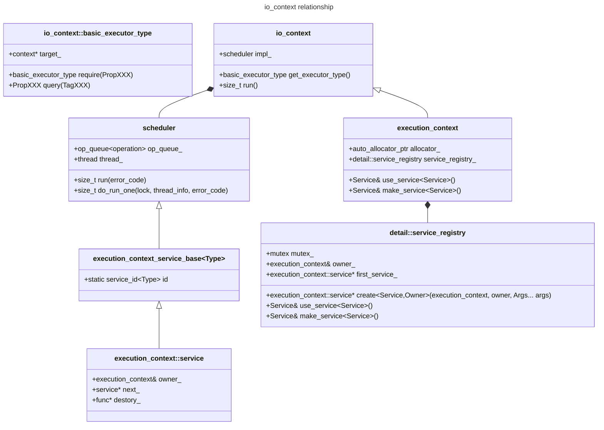
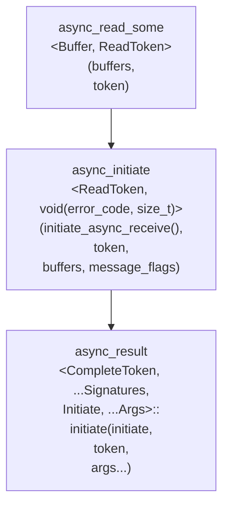
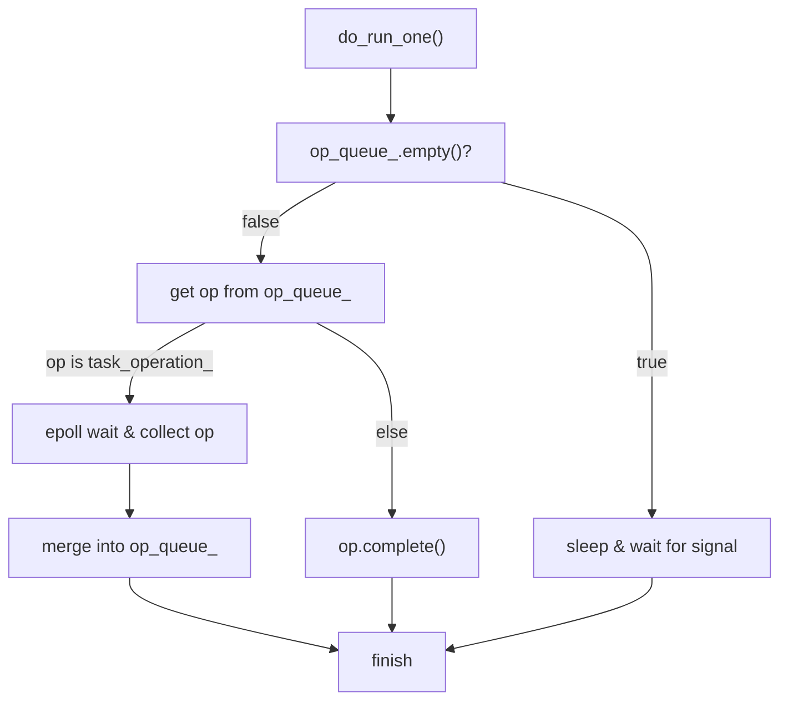

# 引言

本文会从一个简易的 echo 回显服务的例子开始，解析各个类的实现和原理，解析 asio 在 C++20 coroutine 下的异步 I/O 全流程


```cpp
// ref https://www.boost.org/doc/libs/latest/doc/html/boost_asio/example/cpp20/coroutines/echo_server.cpp
#include <boost/asio.hpp>
#include <cstdio>

using boost::asio::ip::tcp;
using boost::asio::awaitable;
using boost::asio::co_spawn;
using boost::asio::detached;
using boost::asio::use_awaitable;
namespace this_coro = boost::asio::this_coro;

#if defined(BOOST_ASIO_ENABLE_HANDLER_TRACKING)
# define use_awaitable \
  boost::asio::use_awaitable_t(__FILE__, __LINE__, __PRETTY_FUNCTION__)
#endif

awaitable<void> echo(tcp::socket socket) {
  try {
    char data[1024];
    for (;;) {
      std::size_t n = co_await socket.async_read_some(boost::asio::buffer(data), use_awaitable);
      co_await async_write(socket, boost::asio::buffer(data, n), use_awaitable);
    }
  } catch (std::exception &e) {
    std::printf("echo Exception: %s\n", e.what());
  }
}

awaitable<void> listener() {
  auto executor = co_await this_coro::executor;
  tcp::acceptor acceptor(executor, {tcp::v4(), 55555});
  for (;;) {
    tcp::socket socket = co_await acceptor.async_accept(use_awaitable);
    co_spawn(executor, echo(std::move(socket)), detached);
  }
}

int main() {
  try {
    boost::asio::io_context io_context(1);
    boost::asio::signal_set signals(io_context, SIGINT, SIGTERM);
    signals.async_wait([&](auto, auto){ io_context.stop(); });

    co_spawn(io_context, listener(), detached);

    io_context.run();
  } catch (std::exception &e) {
    std::printf("Exception: %s\n", e.what());
  }
}
```


# 总览类图



# 异步发起

## basic_stream_socket

这里以异步 socket 读取接口为例


```cpp
template <typename MutableBufferSequence,
          BOOST_ASIO_COMPLETION_TOKEN_FOR(void(boost::system::error_code,
                                               std::size_t))
              ReadToken = default_completion_token_t<executor_type>>
auto async_read_some(
    const MutableBufferSequence &buffers,
    ReadToken &&token = default_completion_token_t<executor_type>())
    -> decltype(async_initiate<ReadToken, void(boost::system::error_code,
                                               std::size_t)>(
        declval<initiate_async_receive>(), token, buffers,
        socket_base::message_flags(0))) {
  return async_initiate<ReadToken,
                        void(boost::system::error_code, std::size_t)>(
      initiate_async_receive(this), token, buffers,
      socket_base::message_flags(0));
}
```




沿着调用路径，将异步发起参数转发给 async_result::initiate() 进行初始化，而 initiate_async_receive() 是 async_read_some 对应的初始化器

最终会调用 initiate_async_receive(this)(token, buffers, message_flags)

### initiate_async_receive()


``` cpp
class initiate_async_receive {
public:
  typedef Executor executor_type;

  explicit initiate_async_receive(basic_stream_socket * self) : self_(self) {}

  const executor_type &get_executor() const noexcept {
    return self_->get_executor();
  }

  template <typename ReadHandler, typename MutableBufferSequence>
  void operator()(ReadHandler &&handler, const MutableBufferSequence &buffers,
                  socket_base::message_flags flags) const {
    detail::non_const_lvalue<ReadHandler> handler2(handler);
    self_->impl_.get_service().async_receive(self_->impl_.get_implementation(),
                                             buffers, flags, handler2.value,
                                             self_->impl_.get_executor());
  }

private:
  basic_stream_socket *self_;
};
```


### use_service()


```cpp
template <typename MutableBufferSequence,
typename Handler, typename IoExecutor>
void async_receive(base_implementation_type& impl,
      const MutableBufferSequence& buffers, socket_base::message_flags flags,
      Handler& handler, const IoExecutor& io_ex) {
  bool is_continuation =
      BOOST_ASIO_VERSIONED_NAME(handler_cont_helpers)::is_continuation(handler);

  associated_cancellation_slot_t<Handler> slot =
      boost::asio::get_associated_cancellation_slot(handler);

  // Allocate and construct an operation to wrap the handler.
  typedef reactive_socket_recv_op<MutableBufferSequence, Handler, IoExecutor>
      op;
  typename op::ptr p = {boost::asio::detail::addressof(handler),
                        op::ptr::allocate(handler), 0};
  p.p = new (p.v) op(success_ec_, impl.socket_, impl.state_, buffers, flags,
                     handler, io_ex);

  // Optionally register for per-operation cancellation.
  if (slot.is_connected()) {
    p.p->cancellation_key_ = &slot.template emplace<reactor_op_cancellation>(
        &reactor_, &impl.reactor_data_, impl.socket_, reactor::read_op);
  }

  BOOST_ASIO_HANDLER_CREATION((reactor_.context(), *p.p, "socket", &impl,
                               impl.socket_, "async_receive"));

  start_op(impl,
           (flags & socket_base::message_out_of_band) ? reactor::except_op
                                                      : reactor::read_op,
           p.p, is_continuation,
           (flags & socket_base::message_out_of_band) == 0,
           ((impl.state_ & socket_ops::stream_oriented) &&
            buffer_sequence_adapter<boost::asio::mutable_buffer,
                                    MutableBufferSequence>::all_empty(buffers)),
           true, &io_ex, 0);
  p.v = p.p = 0;
}
```


# 事件循环

## io_context

io_context 是 asio 中与异步网络类系统调用的桥梁，充当了系统调用的注册发起和异步完成回调的调度主体

1. 事件循环与调度中枢

    io_context 负责管理和调度所有的异步 I/O 操作

    - 所有的 I/O 对象（tcp::socket, steady_timer, ...）都必需绑定到一个 io_context 实例

    - 完成回调由 io_context 分发给 CompleteHander 所绑定工作线程执行

2. 跨平台支持
    
    - Linux：epoll(default), io_uring
    - Windows：IOCP
    - MacOS：kqueue

```cpp
#if defined(BOOST_ASIO_HAS_IOCP)
  typedef win_iocp_io_context io_context_impl;
  class win_iocp_overlapped_ptr;
#else
  typedef scheduler io_context_impl;
#endif
```

io_context_impl 是 **指定平台** 对应的 io_context 调度器抽象类

本文以 Linux 平台所对应的 scheduler 抽象类实现举例

### run()


```cpp
io_context::count_type io_context::run() {
  count_type s = impl_.run(ec);
  return s;
}

std::size_t scheduler::run(boost::system::error_code &ec) {
  thread_info this_thread;
  thread_call_stack::context ctx(this, this_thread);

  mutex::scoped_lock lock(mutex_); // 获取 op_queue_ 锁

  std::size_t n = 0;
  for (; do_run_one(lock, this_thread, ec); lock.lock())
    if (n != (std::numeric_limits<std::size_t>::max)())
      ++n;
  return n;
}
```


> 执行 io_context.run() 的线程通过循环执行 do_run_once() 来推动 scheduler 的异步事件循环

### do_run_one()




```cpp
std::size_t scheduler::do_run_one(mutex::scoped_lock &lock,
                                  scheduler::thread_info &this_thread,
                                  const boost::system::error_code &ec) {
  while (!stopped_) {
    if (!op_queue_.empty()) {
      // 获取待执行 op
      operation *o = op_queue_.front();
      op_queue_.pop();

      if (o == &task_operation_) { // 代表执行 epoll_wait 监听的标记
        // lock.unlock
        // 唤醒其他事件循环线程
        // ...

        // 保持只有一个线程处于 epoll_wait
        // on_exit 析构时重新添加 task_operation_ 进 op_queue_
        task_cleanup on_exit = {this, &lock, &this_thread};

        // 监听 epoll 并把就绪 op 收集到自身 private_op_queue 队列
        // on_exit 析构时添加进 op_queue_
        task_->run(more_handlers ? 0 : task_usec_,
            this_thread.private_op_queue);

        // 减少锁竞争优化
        // on_exit 析构时会去获取 lock 并更新 op_queue_ 队列
        // 所以这里并不会如同执行用户回调 op 一样直接返回，而是再次获取待执行 op
      } else { // 执行就绪的 op
        // lock.unlock
        // 唤醒其他事件循环线程
        // ...

        work_cleanup on_exit = { this, &lock, &this_thread };

        // Complete It!
        // 可能有立刻就绪的 op 产生，收集到 private_op_queue 队列
        // on_exit 析构时添加进 op_queue_
        o->complete(this, ec, o->task_result_);

        return 1; // 统计执行用户提交的异步操作次数
      }
    } else {
      // 空轮询优化
      // ...
    }
  }

  return 0;
}
```


> do_run_one() 为完整的一次事件循环，从全局就绪列表中取出已就绪的异步操作并执行

## operation

```cpp
#if defined(BOOST_ASIO_HAS_IOCP)
typedef win_iocp_operation operation;
#else
typedef scheduler_operation operation;
#endif
```

scheduler 以 operation 为单位进行调度，op_queue_ 为调度器所持有的已就绪异步操作列表

为了统一调度管理，asio 将异步网络的系统调用统一封装为 task_operation_ 标签

取出 task_operation_ 的线程执行 epoll_wait 并收集就绪的系统调用到 op_queue_

| 对象类型           | 来源             | 说明                                              |
| ------------------ | ---------------- | ------------------------------------------------- |
| `task_operation`   | **内部任务调度** | 哨兵对象，执行 epoll_wait 并收集就绪的系统调用    |
| `descriptor_state` | 文件描述符状态   | socket 可读/可写通知，内部持有 reactor_op         |
| `reactor_op`       | I/O 反应器       | 用于 socket 不同类型的操作（读、写、连接、异常）  |
| `wait_op`          | 定时器到期       | deadline_timer_service, steady_timer_service 注册 |
| `user handler_op`  | 用户提交         | `io_context::post()` 提交的函数对象               |

1. task_operation

    当前线程执行 epoll_wait 等待，将就绪的 socket/timer 的 descriptor_state/wait_op 收集到 private_op_queue 中，随后将 private_op_queue 一并合并到 op_queue_ 中等待下一次调度

2. others

    执行 op->complete()，调用完成回调函数

空轮询优化：当启动 io_context.run() 时还未注册异步 I/O，防止空转消耗 CPU 资源，会通过 wakeup_event_ 触发 pthread_cond_wait，直到有新注册的异步 I/O 发送 signal 唤醒

### 基类


```cpp
class scheduler_operation {
public:
  typedef scheduler_operation operation_type;

  void complete(void *owner, const boost::system::error_code &ec,
                std::size_t bytes_transferred) {
    func_(owner, this, ec, bytes_transferred);
  }

  void destroy() { func_(0, this, boost::system::error_code(), 0); }

protected:
  typedef void (*func_type)(void *, scheduler_operation *,
                            const boost::system::error_code &, std::size_t);

  scheduler_operation(func_type func)
      : next_(0), func_(func), task_result_(0) {}

  ~scheduler_operation() {}

private:
  friend class op_queue_access;
  scheduler_operation *next_;
  func_type func_;
protected:
  friend class scheduler;
  unsigned int task_result_; // 记录接受到的字节数
};
```


### descriptor_op

```cpp
// Handle Epoll Wait
for (int i = 0; i < num_events; ++i) {
  void* ptr = events[i].data.ptr; // 从 epoll 返回的结构体解析数据
                                  // 其中 ptr 继承自 operation
                                  // 记录了当前描述符的上下文
  if (!ops.is_enqueued(descriptor_data)) {
    descriptor_data->set_ready_events(events[i].events);
    ops.push(descriptor_data); // 添加到 private_op_queue 中
  } else {
    descriptor_data->add_ready_events(events[i].events);
  }
}

struct descriptor_state : operation {
  descriptor_state *next_;
  descriptor_state *prev_;

  mutex mutex_;
  epoll_reactor *reactor_;
  int descriptor_;
  uint32_t registered_events_;
  op_queue<reactor_op> op_queue_[max_ops];
  bool try_speculative_[max_ops];
  bool shutdown_;

  BOOST_ASIO_DECL descriptor_state(bool locking, int spin_count);
  void set_ready_events(uint32_t events) { task_result_ = events; }
  void add_ready_events(uint32_t events) { task_result_ |= events; }

  // 检测 epoll_wait 返回的 event 类型(read_op, connect_or_write_op, except_op)
  // 收集对应激活的 op_queue_[activate_op_flag...] 到 ops_
  // 返回第一个 op 并交由 do_complete 中执行
  // 其余由追加到 scheduler 的 op_queue_ 中由事件循环推动
  operation *perform_io(uint32_t events) {
    mutex_.lock();
    perform_io_cleanup_on_block_exit io_cleanup(reactor_);
    mutex::scoped_lock descriptor_lock(mutex_, mutex::scoped_lock::adopt_lock);
    static const int flag[max_ops] = {EPOLLIN, EPOLLOUT, EPOLLPRI};
    for (int j = max_ops - 1; j >= 0; --j) {
      if (events & (flag[j] | EPOLLERR | EPOLLHUP)) {
        try_speculative_[j] = true;
        while (reactor_op *op = op_queue_[j].front()) {
          if (reactor_op::status status = op->perform()) {
            op_queue_[j].pop();
            io_cleanup.ops_.push(op);
            if (status == reactor_op::done_and_exhausted) {
              try_speculative_[j] = false;
              break;
            }
          } else
            break;
        }
      }
    }
    io_cleanup.first_op_ = io_cleanup.ops_.front();
    io_cleanup.ops_.pop();
    return io_cleanup.first_op_;
  }

  // 就绪时需要触发的钩子
  // 在事件循环中的 o->complete(this, ec, task_result) 中被调用
  static void do_complete(void *owner, operation *base,
                          const boost::system::error_code &ec,
                          std::size_t bytes_transferred) {
    if (owner) {
      // 检查记录的 owner 是否存活，使用 void* 避免多态开销
      descriptor_state *descriptor_data = static_cast<descriptor_state *>(base);
      uint32_t events = static_cast<uint32_t>(bytes_transferred);
      if (operation *op = descriptor_data->perform_io(events)) {
        op->complete(owner, ec, 0);
      }
    }
  }

  // 继承自 operation，保存 &do_complete 指针到父类 func_ 然后通过 complete 调用
  // 避免虚函数开销
  descriptor_state(bool locking, int spin_count)
      : operation(&epoll_reactor::descriptor_state::do_complete),
        mutex_(locking, spin_count) {}
};
```


## executor

异步任务在完成时需要通过某种机制通知等待它的注册方，对应了 executor 的实现

executor 是实际执行任务的主体，asio 通过给各类调度器封装了一个 executor 以便提交任务到不同的调度器去执行

例如 io_context::executor_type、thread_pool::executor_type 以及 strand\<Executor\> 封装的串行执行 等


```cpp
// executor 通过存储指针 target_ 关联对应的 io_context
// 在 cpp 内存对齐下，指针末两位始终为0
// asio 将其作为标志位表示是否允许阻塞、是否延续执行

struct io_context_bits {
  static constexpr uintptr_t blocking_never = 1;
  static constexpr uintptr_t relationship_continuation = 2;
  static constexpr uintptr_t outstanding_work_tracked = 4;
  static constexpr uintptr_t runtime_bits = 3;
};

template <typename Allocator, uintptr_t Bits>
class io_context::basic_executor_type : detail::io_context_bits, Allocator {
public:
  /// Copy constructor.
  basic_executor_type(const basic_executor_type &other) noexcept
      : Allocator(static_cast<const Allocator &>(other)),
        target_(other.target_) {}

  // 设置 runtime_bits 仅由 execute 使用
  constexpr basic_executor_type
  require(execution::blocking_t::possibly_t) const {
    return basic_executor_type(context_ptr(),
        *this, bits() & ~blocking_never);
  }

  // 查询 runtime_bits
  constexpr execution::blocking_t query(execution::blocking_t) const noexcept {
    return (bits() & blocking_never)
      ? execution::blocking_t(execution::blocking.never)
      : execution::blocking_t(execution::blocking.possibly);
  }

  // 标准接口，适配 std
  template <typename Function> void execute(Function &&f) const;

  template <typename Function, typename OtherAllocator>
  void dispatch(Function &&f, const OtherAllocator &a) const;

  template <typename Function, typename OtherAllocator>
  void post(Function &&f, const OtherAllocator &a) const;

  template <typename Function, typename OtherAllocator>
  void defer(Function &&f, const OtherAllocator &a) const;

private:
  io_context *context_ptr() const noexcept {
    return reinterpret_cast<io_context *>(target_ & ~runtime_bits);
  }

  uintptr_t bits() const noexcept { return target_ & runtime_bits; }

  uintptr_t target_;
};
```


### execute


```cpp
template <typename Allocator, uintptr_t Bits>
template <typename Function>
void io_context::basic_executor_type<Allocator, Bits>::execute(
    Function &&f) const {
  typedef decay_t<Function> function_type;

  // 非阻塞时且当前处于 io_context 循环时，可以直接执行
  if ((bits() & blocking_never) == 0 && context_ptr()->impl_.can_dispatch()) {
    function_type tmp(static_cast<Function&&>(f));

    try {
      detail::fenced_block b(detail::fenced_block::full);
      static_cast<function_type&&>(tmp)();
      return;
    } catch (...) {
      context_ptr()->impl_.capture_current_exception();
      return;
    }
  }

  // 否则转为 operation 入队等待调度执行
  typedef detail::executor_op<function_type, Allocator, detail::operation> op;
  typename op::ptr p = {
      detail::addressof(static_cast<const Allocator &>(*this)),
      op::ptr::allocate(static_cast<const Allocator &>(*this)), 0};
  p.p = new (p.v) op(static_cast<Function&&>(f),
      static_cast<const Allocator&>(*this));

  BOOST_ASIO_HANDLER_CREATION((*context_ptr(), *p.p,
        "io_context", context_ptr(), 0, "execute"));

  context_ptr()->impl_.post_immediate_completion(p.p,
      (bits() & relationship_continuation) != 0);
  p.v = p.p = 0;
}
```


### 执行时机决策

executor 会提供 dispatch、post、defer 三种决策供注册方选择

|          |                    |
| -------- | ------------------ |
| dispatch | 条件允许时立刻执行 |
| post     | 强制异步           |
| defer    | 延迟，但允许优化   |

具体代码可以在 impl/io_context.hpp 中找到（流程类似 execute），这里不再赘述

### can_dispatch()

判断当前线程是否处于对应的 io_context 循环中


```cpp
bool scheduler::can_dispatch() {
  return thread_call_stack::contains(this) != 0;
}
```


thread_call_stack 是专门记录线程的 io_context 调用栈（thread_local），使用了通用的 call_stack\<thread_context, thread_info_base\>构造

在 io_context::[run](#run) 内会构造 thread_call_stack，离开时析构以实现追踪 io_context 嵌套链的效果


```cpp
class thread_context {
public:
  BOOST_ASIO_DECL static thread_info_base* top_of_thread_call_stack();

protected:
  typedef call_stack<thread_context, thread_info_base> thread_call_stack;
};
```


```cpp
template <typename Key, typename Value = unsigned char> class call_stack {
public:
  class context : private noncopyable {
  public:
    explicit context(Key *k) : key_(k), next_(call_stack<Key, Value>::top_) {
      value_ = reinterpret_cast<unsigned char*>(this);
      call_stack<Key, Value>::top_ = this;
    }

    context(Key *k, Value &v)
        : key_(k), value_(&v), next_(call_stack<Key, Value>::top_) {
      call_stack<Key, Value>::top_ = this;
    }

    ~context() { call_stack<Key, Value>::top_ = next_; }

    Value *next_by_key() const {
      context* elem = next_;
      while (elem) {
        if (elem->key_ == key_)
          return elem->value_;
        elem = elem->next_;
      }
      return 0;
    }

  private:
    friend class call_stack<Key, Value>;
    Key* key_;
    Value* value_;
    context* next_;
  };

  friend class context;

  static Value *contains(Key *k) {
    context* elem = top_;
    while (elem) {
      if (elem->key_ == k)
        return elem->value_;
      elem = elem->next_;
    }
    return 0;
  }

  static Value *top() {
    context* elem = top_;
    return elem ? elem->value_ : 0;
  }

private:
  static tss_ptr<context> top_;
};
```


# 完成回调

异步完成时，需要调用对应的回调函数，而完成回调则定义了用户的回调函数在什么时候、在什么地方执行

## CompletionToken

**完成形式**：异步操作完成后调用的函数或标签，约定

举个例子，asio::async_read() 的回调函数签名为 void(error_code, size_t) 代表错误码和已读取字节数

在 CompletionToken = \[&buf\](error_code, size_t) {} 时，则在异步完成时调用该回调函数

在 CompletionToken = asio::use_awaitable 时，则会通过若干转换将其 error_code, size_t 转化为 co_await 异步读取的返回值，在异步完成时恢复当前挂起点并执行后续的协程函数

## CompletionHandler

**完成句柄**：待执行的完成回调上下文，可调用对象

token 通过 async_result 特化转换为具体的 handler
