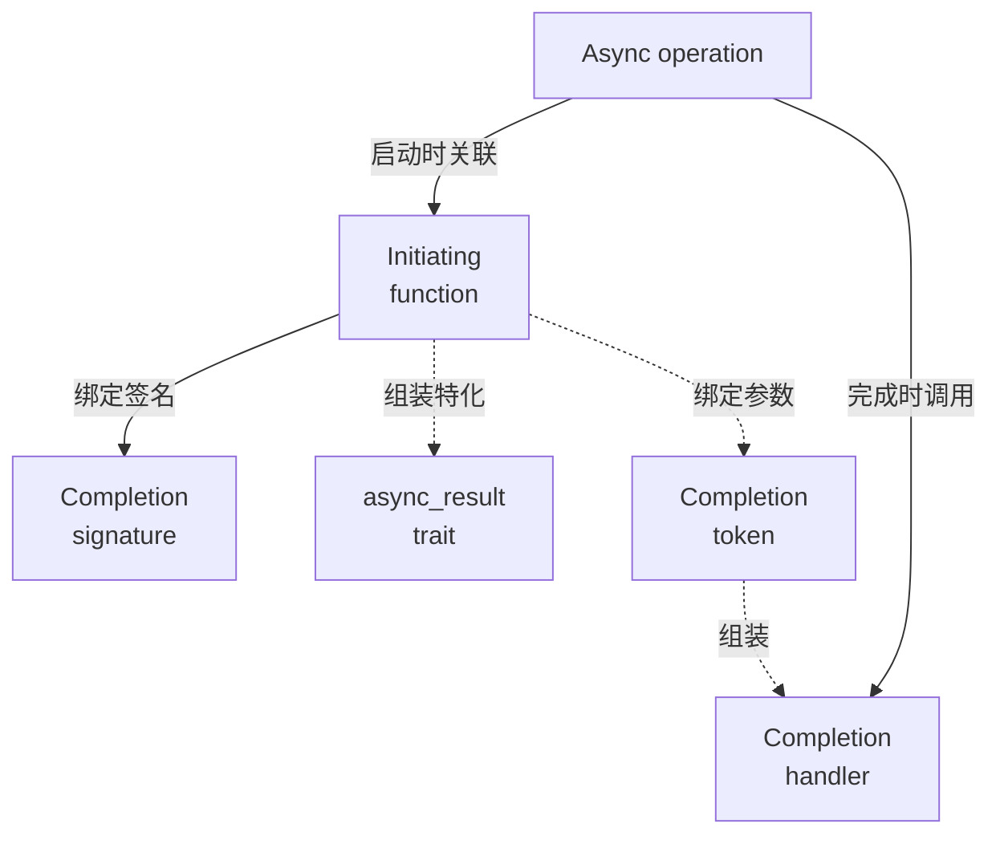
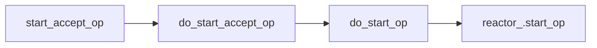
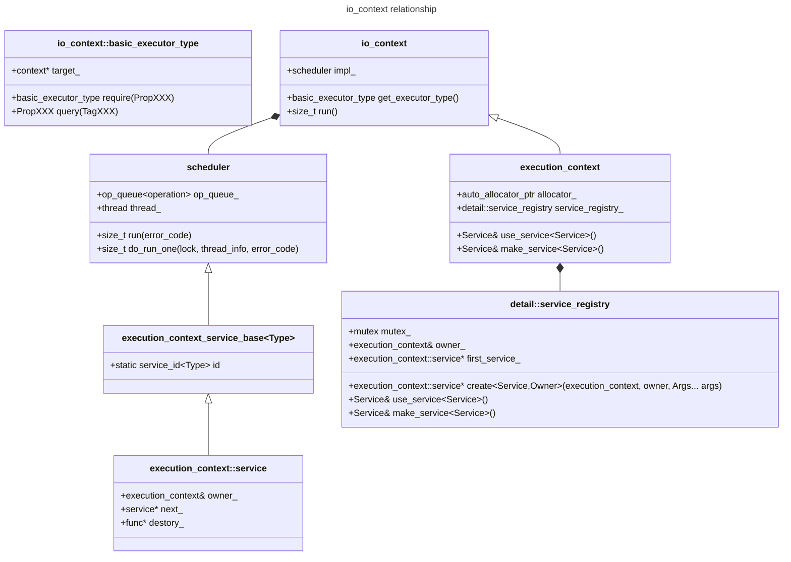
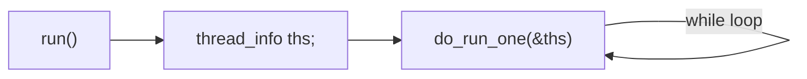
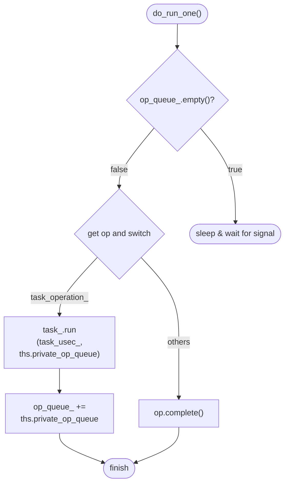

# 引言

Asio 是 C++ 网络编程的事实标准，但多数开发者将其视为“黑盒”

> 我们提交异步操作，等待回调触发，却很少关心事件如何从内核抵达用户态，调度器如何分发任务，以及跨平台抽象层究竟隐藏了哪些细节

本文从一个简单的回显服务例子开始，逐步解析异步接口的底层原理与 C++20 coroutine 的协程式异步适配

[echo_server](https://www.boost.org/doc/libs/latest/doc/html/boost_asio/example/cpp14/echo/async_tcp_echo_server.cpp)

# 前置

## CompletionToken

Asio 对异步 op 就绪时（When）的完成回调，允许自定义其形式（How）和执行位置（Where）


```mermaid
flowchart TD
    async_op["Async operation"] -- 启动时关联 --> init_fn["Initiating\nfunction"]
    async_op -- 完成时调用 --> completion_hander["Completion\nhandler"]
    init_fn -- 绑定签名 --> completion_signature["Completion\nsignature"]
    init_fn -. 组装特化 .-> async_result["async_result\ntrait"]
    init_fn -. 绑定参数 .-> completion_token["Completion\ntoken"]
    completion_token -. 组装 .-> completion_hander
```

**完成令牌**：异步操作完成后调用的回调函数或约定

**完成程序**：待执行的完成回调子程序，通过完成令牌组装而成

以 asio::async_read() 异步读取接口为例，该接口的回调函数签名固定为 void(error_code, size_t) 分别代表错误码和已读取字节数

异步结果的返回形式则根据完成令牌类型分为

1. 回调函数

    用户传入的 Complete token 对象必需为满足该签名的 Callable 对象，并组装成 Completion handler。当异步完成时会调用通知函数 complete() 将该 handler 带上 error_code, size_t 并提交到指定的 executor 执行

2. 约定
    
    作为决定完成回调的执行形式

    1. use_feature

        返回 future，该类型完成回调不能指定 executor。因为 future 是在调用方，由调用方自行调用 get 阻塞等待异步完成并获取 error_code, size_t

    2. use_awaitable
    
        根据签名使用 awaitable<std::tuple<error_code, size_t>, Executor> 作为该 co_await 的 callee 协程可等待对象

        挂起当前协程，将恢复句柄封装为 Completion Handler 并提交到指定的 Executor 上执行

        提交环节视作为异步任务，当对应 Executor 的执行上下文切换完成时通过保存的协程恢复句柄恢复挂起的协程体并通过 awaitable_frame 对象传入和取出 error_code, size_t 并执行后续的协程内容 [详见](#协程适配)

    3. deferred

        与 use_awaitable 类似，不同的是异步调用不会新建 callee 协程体而是通过封装延迟的异步操作对象

        将当前协程的恢复句柄封装为 awaitable_async_op，并通过异步完成时一并传入返回值以恢复协程体并获取到异步结果 [详见](#awaitable_async_op)

# 异步发起

## basic_socket_acceptor


```cpp
template <typename Protocol, typename Executor>
class basic_socket_acceptor : public socket_base {
  void open(const protocol_type &protocol = protocol_type()) {
    boost::system::error_code ec;
    impl_.get_service().open(impl_.get_implementation(), protocol, ec);
    boost::asio::detail::throw_error(ec, "open");
  }
}
```


> 创建 acceptor 并开启协议时，会调用到内部关联的 reactive_socket_service 服务 open 函数（创建服务端 socket 并挂载到 epoll_reactor 上 accept 连接 [详见](#reactive_socket_service)）

### async_accept()


```cpp
template <BOOST_ASIO_COMPLETION_TOKEN_FOR(
              void(boost::system::error_code,
                   typename Protocol::socket::template rebind_executor<
                       executor_type>::other))
              MoveAcceptToken = default_completion_token_t<executor_type>>
auto async_accept(
    MoveAcceptToken &&token = default_completion_token_t<executor_type>())
    -> decltype(async_initiate<
                MoveAcceptToken,
                void(boost::system::error_code,
                     typename Protocol::socket::template rebind_executor<
                         executor_type>::other)>(
        declval<initiate_async_move_accept>(), token,
        declval<const executor_type &>(), static_cast<endpoint_type *>(0),
        static_cast<typename Protocol::socket::template rebind_executor<
            executor_type>::other *>(0))) {
  return async_initiate<
      MoveAcceptToken, void(boost::system::error_code,
                            typename Protocol::socket::template rebind_executor<
                                executor_type>::other)>(
      initiate_async_move_accept(this), token, impl_.get_executor(),
      static_cast<endpoint_type *>(0),
      static_cast<typename Protocol::socket::template rebind_executor<
          executor_type>::other *>(0));
}
```


```
调用链：
-> async_accept<MoveAcceptToken>(token)
  -> async_initiate<MoveAcceptToken, void(error_code, socket)>(initiate_async_move_accept(this), token, impl_.get_executor(), endpoint_type*(0), socket*(0))
    -> async_result<CompleteToken, ...Signatures, Initiate, ...Args>::initiate(initiate, token, args...)

沿着调用路径，将异步发起参数转发给 async_result::initiate() 进行初始化
最终由 async_result::initiate 统一负责异步接口的初始化
即调用到 initiate_async_move_accept(this)(token, impl_.get_executor(), NULL, NULL)
```

### initiate_async_move_accept()

```cpp 
class initiate_async_move_accept {
public:
  typedef Executor executor_type;

  explicit initiate_async_move_accept(basic_socket_acceptor *self)
      : self_(self) {}

  const executor_type &get_executor() const noexcept {
    return self_->get_executor();
  }

  template <typename MoveAcceptHandler, typename Executor1, typename Socket>
  void operator()(MoveAcceptHandler &&handler, const Executor1 &peer_ex,
                  endpoint_type *peer_endpoint, Socket *) const {
    detail::non_const_lvalue<MoveAcceptHandler> handler2(handler);
    self_->impl_.get_service().async_move_accept(
        self_->impl_.get_implementation(), peer_ex, peer_endpoint,
        handler2.value, self_->impl_.get_executor());
  }

private:
  basic_socket_acceptor *self_;
};
```


> self_ 持有 reactive_socket_service 服务创建的 impl，通过服务的 async_move_accept 完成 impl 异步初始化 [详见](#async_move_accept)

## basic_stream_socket

构建 socket 对象时也会调用到内部关联的 reactive_socket_service 服务 open 函数，可自行查看源代码

由于 accept 严格意义上将并不是创建一个新的 socket，而是由操作系统把一个已有的客户端 socket 转移到用户程序中

所以并不会调用到 socket 对象的构建流程，而是使用 assign 函数完成转移（流程上类似 open [详见](#reactive_socket_service)）

### async_read_some()


```cpp
template <typename MutableBufferSequence,
          BOOST_ASIO_COMPLETION_TOKEN_FOR(void(boost::system::error_code,
                                               std::size_t))
              ReadToken = default_completion_token_t<executor_type>>
auto async_read_some(
    const MutableBufferSequence &buffers,
    ReadToken &&token = default_completion_token_t<executor_type>())
    -> decltype(async_initiate<ReadToken, void(boost::system::error_code,
                                               std::size_t)>(
        declval<initiate_async_receive>(), token, buffers,
        socket_base::message_flags(0))) {
  return async_initiate<ReadToken,
                        void(boost::system::error_code, std::size_t)>(
      initiate_async_receive(this), token, buffers,
      socket_base::message_flags(0));
}
```


```
调用链：
-> async_read_some<Buffer, ReadToken>(buffers, token)
  -> async_initiate<ReadToken, void(error_code, size_t)>(initiate_async_receive(this), token, buffers, message_flags)
    -> async_result<CompleteToken, ...Signatures, Initiate, ...Args>::initiate(initiate, token, args...)

同上
调用到 initiate_async_receive(this)(token, buffers, message_flags)
```

### initiate_async_receive()


``` cpp
class initiate_async_receive {
public:
  typedef Executor executor_type;

  explicit initiate_async_receive(basic_stream_socket * self) : self_(self) {}

  const executor_type &get_executor() const noexcept {
    return self_->get_executor();
  }

  template <typename ReadHandler, typename MutableBufferSequence>
  void operator()(ReadHandler &&handler, const MutableBufferSequence &buffers,
                  socket_base::message_flags flags) const {
    detail::non_const_lvalue<ReadHandler> handler2(handler);
    self_->impl_.get_service().async_receive(self_->impl_.get_implementation(),
                                             buffers, flags, handler2.value,
                                             self_->impl_.get_executor());
  }

private:
  basic_stream_socket *self_;
};
```


> self_ 持有 reactive_socket_service 服务创建的 impl，通过服务的 async_receive 完成 impl 异步初始化 [详见](#async_receive)

## io_object_impl


```cpp
template <typename IoObjectService,
    typename Executor = io_context::executor_type>
class io_object_impl {
  io_object_impl(int, const executor_type &ex)
      : service_(&boost::asio::use_service<IoObjectService>(
            io_object_impl::get_context(ex))),
        executor_(ex) {
    service_->construct(implementation_);
  }
};
```


> io_object_impl 是负责构造/使用 service 创建 impl 的抽象泛型类

service_registry 是 Asio 用于延迟、按需初始化服务的机制，把公共服务设施挂载到 executor_context 上，避免重复创建或在不需要时创建造成的额外开销

当需要使用指定服务类时，可通过调用 make_service 转发参数构造或 use_service 默认初始化构造，已存在则直接返回类引用

参考 detail::service_registry 中的实现 [详见](#io_context)

> 以 Linux 中的 Epoll 举例，service 对应到 eventpoll，而 impl 对应到 eventpoll 设施中的 epitem 事件节点

## reactive_socket_service

```cpp
typedef epoll_reactor reactor;

template <typename Protocol>
class reactive_socket_service :
  public execution_context_service_base<reactive_socket_service<Protocol>>,
  public reactive_socket_service_base {
  struct implementation_type
      : reactive_socket_service_base::base_implementation_type {
    implementation_type() : protocol_(endpoint_type().protocol()) {}
    // 协议类型
    protocol_type protocol_;
  };

  // 创建 socket 到 impl
  boost::system::error_code open(implementation_type &impl,
                                 const protocol_type &protocol,
                                 boost::system::error_code &ec) {
    if (!do_open(impl, protocol.family(),
          protocol.type(), protocol.protocol(), ec))
      impl.protocol_ = protocol;
    return ec;
  }

  // 转移原生 socket 到 impl
  boost::system::error_code assign(implementation_type &impl,
                                   const protocol_type &protocol,
                                   const native_handle_type &native_socket,
                                   boost::system::error_code &ec) {
    if (!do_assign(impl, protocol.type(), native_socket, ec))
      impl.protocol_ = protocol;
    return ec;
  }
};
```

> 管理 socket 操作相关的 service 类

### reactive_socket_service_base


```cpp
class reactive_socket_service_base {
  struct base_implementation_type {
    // 原始 socket
    socket_type socket_;
    // 状态
    socket_ops::state_type state_;
    // 挂载到 reactor 上的异步 op 指针
    descriptor_state *reactor_data_;
  };

  // 构造 epoll_reactor
  reactive_socket_service_base(execution_context &context)
      : reactor_(use_service<reactor>(context)) {}

  boost::system::error_code
  do_open(reactive_socket_service_base::base_implementation_type &impl, int af,
          int type, int protocol, boost::system::error_code &ec) {
    if (is_open(impl)) {
      ec = boost::asio::error::already_open;
      return ec;
    }

    // 创建 server socket
    socket_holder sock(socket_ops::socket(af, type, protocol, ec));
    if (sock.get() == invalid_socket)
      return ec;

    // 往 epoll_reactor 上注册当前 server socket 相关的 I/O 事件
    // 初始化 reactor_data_
    // 设置 ptr 为 acceptor 的 impl.reactor_data_ 指针
    if (int err =
            reactor_.register_descriptor(sock.get(), impl.reactor_data_)) {
      ec = boost::system::error_code(err,
                                     boost::asio::error::get_system_category());
      return ec;
    }

    impl.socket_ = sock.release();
    switch (type) {
    case SOCK_STREAM:
      impl.state_ = socket_ops::stream_oriented | extra_state_;
      break;
    case SOCK_DGRAM:
      impl.state_ = socket_ops::datagram_oriented | extra_state_;
      break;
    default:
      impl.state_ = 0;
      break;
    }
    ec = boost::system::error_code();
    return ec;
  }

  boost::system::error_code reactive_socket_service_base::do_assign(
      reactive_socket_service_base::base_implementation_type &impl, int type,
      const reactive_socket_service_base::native_handle_type &native_socket,
      boost::system::error_code &ec) {
    if (is_open(impl)) {
      ec = boost::asio::error::already_open;
      return ec;
    }

    // 往 epoll_reactor 上注册当前 socket 相关的 I/O 事件
    if (int err =
            reactor_.register_descriptor(native_socket, impl.reactor_data_)) {
      ec = boost::system::error_code(err,
                                     boost::asio::error::get_system_category());
      return ec;
    }

    // 转移当前 socket
    impl.socket_ = native_socket;
    switch (type) {
    case SOCK_STREAM:
      impl.state_ = socket_ops::stream_oriented | extra_state_;
      break;
    case SOCK_DGRAM:
      impl.state_ = socket_ops::datagram_oriented | extra_state_;
      break;
    default:
      impl.state_ = 0;
      break;
    }
    impl.state_ |= socket_ops::possible_dup;
    ec = boost::system::error_code();
    return ec;
  }

  void construct(base_implementation_type& impl);

  reactor& reactor_;
};
```


> Asio 将协议无关的代码划分到了 reactive_socket_service_base 基类中，仅由派生类处理协议相关内容以减少重复的二进制代码

> 对应的异步 op 为 descriptor_state [详见](#descriptor_state)

### async_move_accept()


```cpp
template <typename PeerIoExecutor, typename Handler, typename IoExecutor>
void async_move_accept(implementation_type &impl,
                       const PeerIoExecutor &peer_io_ex,
                       endpoint_type *peer_endpoint, Handler &handler,
                       const IoExecutor &io_ex) {
  bool is_continuation =
      BOOST_ASIO_VERSIONED_NAME(handler_cont_helpers)::is_continuation(handler);

  associated_cancellation_slot_t<Handler> slot =
      boost::asio::get_associated_cancellation_slot(handler);

  typedef reactive_socket_move_accept_op<Protocol, PeerIoExecutor, Handler,
                                         IoExecutor>
      op;
  typename op::ptr p = {boost::asio::detail::addressof(handler),
                        op::ptr::allocate(handler), 0};
  p.p = new (p.v) op(success_ec_, peer_io_ex, impl.socket_, impl.state_,
                     impl.protocol_, peer_endpoint, handler, io_ex);

  if (slot.is_connected()) {
    p.p->cancellation_key_ = &slot.template emplace<reactor_op_cancellation>(
        &reactor_, &impl.reactor_data_, impl.socket_, reactor::read_op);
  }

  start_accept_op(impl, p.p, is_continuation, false, &io_ex, 0);
  p.v = p.p = 0;
}
```


> 将异步接受连接及完成回调封装成 reactive_socket_move_accept_op，调用 start_accept_op 挂载到 reactor_ 服务里对应的 descriptor_state 上等待事件到达 [详见](#start_op)

> reactor_ 即 epoll_reactor，在 reactive_socket_service_base 初始化之时通过 use_service 创建

> descriptor_state 对应了操作系统中的文件描述符 fd 的封装


```mermaid
flowchart LR
    start_accept_op --> do_start_accept_op --> do_start_op --> reactor_.start_op
```

> 在 do_start_accept_op 函数中，accept 实际对应的 op_types 为 reactor::read_op。表示该连接的三次握手已完成，进入全连接队列，内核将该 fd 标记为可读

#### reactive_socket_move_accept_op


```cpp template <typename Protocol, typename PeerIoExecutor, typename Handler,
                 typename IoExecutor>
class reactive_socket_move_accept_op
    : private Protocol::socket::template rebind_executor<PeerIoExecutor>::other,
      public reactive_socket_accept_op_base<
          typename Protocol::socket::template rebind_executor<
              PeerIoExecutor>::other,
          Protocol> {
public:
  typedef Handler handler_type;
  typedef IoExecutor io_executor_type;

  // RAII 资源管理指针
  BOOST_ASIO_DEFINE_HANDLER_PTR(reactive_socket_move_accept_op);

  reactive_socket_move_accept_op(const boost::system::error_code &success_ec,
                                 const PeerIoExecutor &peer_io_ex,
                                 socket_type socket,
                                 socket_ops::state_type state,
                                 const Protocol &protocol,
                                 typename Protocol::endpoint *peer_endpoint,
                                 Handler &handler, const IoExecutor &io_ex)
      : peer_socket_type(peer_io_ex),
        reactive_socket_accept_op_base<peer_socket_type, Protocol>(
            success_ec, socket, state, *this, protocol, peer_endpoint,
            &reactive_socket_move_accept_op::do_complete),
        handler_(static_cast<Handler &&>(handler)), work_(handler_, io_ex) {}

  // 就绪时调用的通知函数
  static void do_complete(void *owner, operation *base,
                          const boost::system::error_code & /*ec*/,
                          std::size_t /*bytes_transferred*/) {
    reactive_socket_move_accept_op* o(
        static_cast<reactive_socket_move_accept_op*>(base));
    ptr p = { boost::asio::detail::addressof(o->handler_), o, o };

    // 将 socket 从 new_socket_ 转移到自身
    if (owner)
      o->do_assign();

    handler_work<Handler, IoExecutor> w(
        static_cast<handler_work<Handler, IoExecutor>&&>(
          o->work_));

    // 绑定异步事件的 I/O 结果到 handler，即 error_code 和 socket
    detail::move_binder2<Handler,
      boost::system::error_code, peer_socket_type>
        handler(0, static_cast<Handler&&>(o->handler_), o->ec_,
          static_cast<peer_socket_type&&>(*o));
    p.h = boost::asio::detail::addressof(handler.handler_);
    p.reset();

    if (owner) {
      // 内存屏障
      fenced_block b(fenced_block::half);
      // 调用实际的通知函数，将 handler 提交到 handler.handler_ 绑定的 executor 去执行
      w.complete(handler, handler.handler_);
    }
  }

private:
  typedef typename Protocol::socket::template
    rebind_executor<PeerIoExecutor>::other peer_socket_type;
  Handler handler_;
  handler_work<Handler, IoExecutor> work_;
};

template <typename Socket, typename Protocol>
class reactive_socket_accept_op_base : public reactor_op {
public:
  reactive_socket_accept_op_base(const boost::system::error_code &success_ec,
                                 socket_type socket,
                                 socket_ops::state_type state, Socket &peer,
                                 const Protocol &protocol,
                                 typename Protocol::endpoint *peer_endpoint,
                                 func_type complete_func)
      : reactor_op(success_ec, &reactive_socket_accept_op_base::do_perform,
                   complete_func),
        socket_(socket), state_(state), peer_(peer), protocol_(protocol),
        peer_endpoint_(peer_endpoint),
        addrlen_(peer_endpoint ? peer_endpoint->capacity() : 0) {}

  // 事件到达时执行
  // 从 socket_ops::accept 系统调用中取出 socket 并存入 new_socket_ 中
  static status do_perform(reactor_op *base) {
    BOOST_ASIO_ASSUME(base != 0);
    reactive_socket_accept_op_base* o(
        static_cast<reactive_socket_accept_op_base*>(base));

    socket_type new_socket = invalid_socket;
    // accept 系统调用
    status result = socket_ops::non_blocking_accept(o->socket_,
        o->state_, o->peer_endpoint_ ? o->peer_endpoint_->data() : 0,
        o->peer_endpoint_ ? &o->addrlen_ : 0, o->ec_, new_socket)
    ? done : not_done;
    o->new_socket_.reset(new_socket);
    return result;
  }

  // 从 new_socket_ 中转移给自身
  void do_assign() {
    if (new_socket_.get() != invalid_socket) {
      if (peer_endpoint_)
        peer_endpoint_->resize(addrlen_);
      peer_.assign(protocol_, new_socket_.get(), ec_);
      if (!ec_)
        new_socket_.release();
    }
  }

private:
  socket_type socket_;
  socket_ops::state_type state_;
  socket_holder new_socket_;
  Socket& peer_;
  Protocol protocol_;
  typename Protocol::endpoint* peer_endpoint_;
  std::size_t addrlen_;
};
```


> 当该事件到来时，调用 reactor_op::perform() 从 socket_ops::accept 系统调用中取出 socket 并存入当前 op 的 new_socket_ 中

> reactor_op 是依附在 epoll_reactor::descriptor_state 上存在的，代表该 fd 上的异步操作 [详见](#descriptor_state)



```cpp
template <typename Handler, typename IoExecutor, typename = void>
class handler_work
    : handler_work_base<IoExecutor>,
      handler_work_base<associated_executor_t<Handler, IoExecutor>,
                        IoExecutor> {
public:
  typedef handler_work_base<IoExecutor> base1_type;
  typedef handler_work_base<associated_executor_t<Handler, IoExecutor>,
      IoExecutor> base2_type;

  handler_work(Handler &handler, const IoExecutor &io_ex) noexcept
      : base1_type(0, 0, io_ex),
        base2_type(base1_type::owns_work(),
                   boost::asio::get_associated_executor(handler, io_ex),
                   io_ex) {}

  template <typename Function>
  void complete(Function &function, Handler &handler) {
    if (!base1_type::owns_work() && !base2_type::owns_work()) {
      static_cast<Function&&>(function)();
    } else {
      base2_type::dispatch(function, handler);
    }
  }
};
```


> 当异步完成时，调用 complete 函数完成通知或就地执行（如果是 io_context 的内部事件，或者 IoExecutor 和 指定的 HandlerExecutor 是同一个，则直接在 io_context 的事件循环中执行，不需要再经过 dispatch 提交到 op_queue_ 等待调度执行）

dispatch 依赖所指定的 executor 实现 [详见](#执行时机决策)

### async_receive()


```cpp
template <typename MutableBufferSequence,
typename Handler, typename IoExecutor>
void async_receive(base_implementation_type& impl,
      const MutableBufferSequence& buffers, socket_base::message_flags flags,
      Handler& handler, const IoExecutor& io_ex) {
  bool is_continuation =
      BOOST_ASIO_VERSIONED_NAME(handler_cont_helpers)::is_continuation(handler);

  associated_cancellation_slot_t<Handler> slot =
      boost::asio::get_associated_cancellation_slot(handler);

  typedef reactive_socket_recv_op<MutableBufferSequence, Handler, IoExecutor>
      op;
  typename op::ptr p = {boost::asio::detail::addressof(handler),
                        op::ptr::allocate(handler), 0};
  p.p = new (p.v) op(success_ec_, impl.socket_, impl.state_, buffers, flags,
                     handler, io_ex);

  if (slot.is_connected()) {
    p.p->cancellation_key_ = &slot.template emplace<reactor_op_cancellation>(
        &reactor_, &impl.reactor_data_, impl.socket_, reactor::read_op);
  }

  start_op(impl,
           (flags & socket_base::message_out_of_band) ? reactor::except_op
                                                      : reactor::read_op,
           p.p, is_continuation,
           (flags & socket_base::message_out_of_band) == 0,
           ((impl.state_ & socket_ops::stream_oriented) &&
            buffer_sequence_adapter<boost::asio::mutable_buffer,
                                    MutableBufferSequence>::all_empty(buffers)),
           true, &io_ex, 0);
  p.v = p.p = 0;
}
```


> 同上，将异步读取及完成回调封装成 reactive_socket_recv_op 并通过 start_op 完成挂载

## epoll_reactor

### descriptor_state


```cpp
// 一个 descriptor_state 对应一个 fd
// 其上挂载了所有等待它的异步操作
struct descriptor_state : operation {
  descriptor_state *next_;
  descriptor_state *prev_;

  mutex mutex_;
  epoll_reactor *reactor_;
  int descriptor_;
  uint32_t registered_events_;
  op_queue<reactor_op> op_queue_[max_ops];
  bool try_speculative_[max_ops];
  bool shutdown_;

  descriptor_state(bool locking, int spin_count);
  void set_ready_events(uint32_t events) { task_result_ = events; }
  void add_ready_events(uint32_t events) { task_result_ |= events; }

  // 检测 epoll_wait 返回的 event 类型(read_op, connect_or_write_op, except_op)
  // 收集对应激活的 op_queue_[activate_op_flag...] 到 ops_
  // 返回第一个 op 并交由 do_complete 中执行
  // 其余由追加到 scheduler 的 op_queue_ 中由事件循环推动
  operation *perform_io(uint32_t events) {
    mutex_.lock();
    perform_io_cleanup_on_block_exit io_cleanup(reactor_);
    mutex::scoped_lock descriptor_lock(mutex_, mutex::scoped_lock::adopt_lock);
    static const int flag[max_ops] = {EPOLLIN, EPOLLOUT, EPOLLPRI};
    for (int j = max_ops - 1; j >= 0; --j) {
      if (events & (flag[j] | EPOLLERR | EPOLLHUP)) {
        try_speculative_[j] = true;
        while (reactor_op *op = op_queue_[j].front()) {
          if (reactor_op::status status = op->perform()) {
            op_queue_[j].pop();
            io_cleanup.ops_.push(op);
            if (status == reactor_op::done_and_exhausted) {
              try_speculative_[j] = false;
              break;
            }
          } else
            break;
        }
      }
    }
    io_cleanup.first_op_ = io_cleanup.ops_.front();
    io_cleanup.ops_.pop();
    return io_cleanup.first_op_;
  }

  // 就绪时需要触发的钩子
  // 在事件循环中的 o->complete(this, ec, task_result) 中被调用
  static void do_complete(void *owner, operation *base,
                          const boost::system::error_code &ec,
                          std::size_t bytes_transferred) {
    if (owner) {
      // 检查记录的 owner 是否存活，使用 void* 避免多态开销
      descriptor_state *descriptor_data = static_cast<descriptor_state *>(base);
      uint32_t events = static_cast<uint32_t>(bytes_transferred);
      if (operation *op = descriptor_data->perform_io(events)) {
        op->complete(owner, ec, 0);
      }
    }
  }

  // 继承自 operation，保存 &do_complete 指针到父类 func_ 然后通过 complete 调用
  descriptor_state(bool locking, int spin_count)
      : operation(&epoll_reactor::descriptor_state::do_complete),
        mutex_(locking, spin_count) {}
};
```


> 对应到 fd 的上下文

### start_op()


```cpp
void epoll_reactor::start_op(int op_type, socket_type descriptor,
                        epoll_reactor::per_descriptor_data &descriptor_data,
                        reactor_op *op, bool is_continuation,
                        bool allow_speculative,
                        void (*on_immediate)(operation *, bool, const void *),
                        const void *immediate_arg) {
  if (!descriptor_data) {
    op->ec_ = boost::asio::error::bad_descriptor;
    on_immediate(op, is_continuation, immediate_arg);
    return;
  }

  mutex::scoped_lock descriptor_lock(descriptor_data->mutex_);

  if (descriptor_data->shutdown_) {
    on_immediate(op, is_continuation, immediate_arg);
    return;
  }

  if (descriptor_data->op_queue_[op_type].empty()) {
    if (allow_speculative &&
        (op_type != read_op || descriptor_data->op_queue_[except_op].empty())) {
      if (descriptor_data->try_speculative_[op_type]) {
        if (reactor_op::status status = op->perform()) {
          if (status == reactor_op::done_and_exhausted)
            if (descriptor_data->registered_events_ != 0)
              descriptor_data->try_speculative_[op_type] = false;
          descriptor_lock.unlock();
          on_immediate(op, is_continuation, immediate_arg);
          return;
        }
      }

      if (descriptor_data->registered_events_ == 0) {
        op->ec_ = boost::asio::error::operation_not_supported;
        on_immediate(op, is_continuation, immediate_arg);
        return;
      }

      if (op_type == write_op) {
        if ((descriptor_data->registered_events_ & EPOLLOUT) == 0) {
          epoll_event ev = { 0, { 0 } };
          ev.events = descriptor_data->registered_events_ | EPOLLOUT;
          ev.data.ptr = descriptor_data;
          if (epoll_ctl(epoll_fd_, EPOLL_CTL_MOD, descriptor, &ev) == 0) {
            descriptor_data->registered_events_ |= ev.events;
          } else {
            op->ec_ = boost::system::error_code(
                errno, boost::asio::error::get_system_category());
            on_immediate(op, is_continuation, immediate_arg);
            return;
          }
        }
      }
    } else if (descriptor_data->registered_events_ == 0) {
      op->ec_ = boost::asio::error::operation_not_supported;
      on_immediate(op, is_continuation, immediate_arg);
      return;
    } else {
      if (op_type == write_op) {
        descriptor_data->registered_events_ |= EPOLLOUT;
      }

      epoll_event ev = {0, {0}};
      ev.events = descriptor_data->registered_events_;
      ev.data.ptr = descriptor_data;
      epoll_ctl(epoll_fd_, EPOLL_CTL_MOD, descriptor, &ev);
    }
  }

  descriptor_data->op_queue_[op_type].push(op);
  scheduler_.work_started();
}
```


> 中间都是一些状态判断，我们只需要关注最后的 descriptor_data->op_queue_[op_type].push(op);

> 将当前 op 挂载到 fd 的 op_type 类型的 op_queue_ 中，等待对应事件的触发

### run()


```cpp
void epoll_reactor::run(long usec, op_queue<operation> &ops) {
  // Calculate timeout. Check the timer queues only if timerfd is not in use.
  int timeout;
  if (usec == 0)
    timeout = 0;
  else {
    timeout = (usec < 0) ? -1 : ((usec - 1) / 1000 + 1);
    if (timer_fd_ == -1) {
      mutex::scoped_lock lock(mutex_);
      timeout = get_timeout(timeout);
    }
  }

  // 获取 epoll_wait 就绪事件
  epoll_event events[128];
  int num_events = epoll_wait(epoll_fd_, events, 128, timeout);

  for (int i = 0; i < num_events; ++i) {
    // 获取 fd 的上下文
    void* ptr = events[i].data.ptr;
    descriptor_state *descriptor_data = static_cast<descriptor_state *>(ptr);
    if (!ops.is_enqueued(descriptor_data)) {
      descriptor_data->set_ready_events(events[i].events);
      ops.push(descriptor_data);
    } else {
      descriptor_data->add_ready_events(events[i].events);
    }
  }

  // 裁剪了 timer_fd 相关的逻辑
}
```


> epoll_reactor 对应到 epoll_wait 的事件循环（由 io_context 事件循环中的 task_operation_ 调用 task_.run() [详见](#scheduler)）

# 事件循环

## io_context


```mermaid
---
title: io_context relationship
---
classDiagram
    class i__basic_executor_type["io_context::basic_executor_type"] {
        +context* target_

        +basic_executor_type require(PropXXX)
        +PropXXX query(TagXXX)
    }

    class e__service["execution_context::service"] {
        +execution_context& owner_
        +service* next_
        +func* destory_
    }

    class execution_context_service_base~Type~ {
        +static service_id~Type~ id
    }

    execution_context_service_base <|-- e__service

    class d__service_registry["detail::service_registry"] {
        +mutex mutex_
        +execution_context& owner_
        +execution_context::service* first_service_

        +execution_context::service* create~Service,Owner~(execution_context, owner, Args... args) 
        +Service& use_service~Service~()
        +Service& make_service~Service~()
    }

    class execution_context {
        +auto_allocator_ptr allocator_
        +detail::service_registry service_registry_

        +Service& use_service~Service~()
        +Service& make_service~Service~()
    }

    execution_context *-- d__service_registry

    class scheduler {
        +op_queue~operation~ op_queue_
        +thread thread_

        +size_t run(error_code)
        +size_t do_run_one(lock, thread_info, error_code)
    }

    scheduler <|-- execution_context_service_base

    class io_context {
        +scheduler impl_

        +basic_executor_type get_executor_type() 
        +size_t run()
    }

    io_context *-- scheduler
    io_context <|-- execution_context
```

io_context 是 Asio 中与异步网络类系统调用的桥梁，充当了系统调用的注册发起和异步完成回调的调度主体

1. 事件循环与调度中枢

    io_context 负责管理和调度所有的异步 I/O 操作

    - 所有的 I/O 对象（tcp::socket, steady_timer, ...）都必需绑定到一个 io_context 实例

    - 完成回调由 io_context 分发给 CompleteHander 所绑定工作线程执行

2. 跨平台支持
    
    - Linux：epoll(default), io_uring
    - Windows：IOCP
    - MacOS：kqueue

```cpp
#if defined(BOOST_ASIO_HAS_IOCP)
  typedef win_iocp_io_context io_context_impl;
  class win_iocp_overlapped_ptr;
#else
  typedef scheduler io_context_impl;
#endif
```

io_context_impl 是 **指定平台** 对应的 io_context 调度器抽象类

### run()


```cpp
io_context::count_type io_context::run() {
  count_type s = impl_.run(ec);
  return s;
}
```


> run() 转发到实际实现 io_context_impl.run()

## scheduler

以 Linux 平台所对应的 scheduler 实现为例


```mermaid
flowchart LR
    run["run()"]-->thread_info["thread_info ths;"]
    thread_info-->do_run_one1["do_run_one(&ths)"]
    do_run_one1-- while loop -->do_run_one1
```

```mermaid
flowchart TD
    do_run_one(["do_run_one()"])-->op_empty_switch{"op_queue_.empty()?"}
    op_empty_switch-- false -->get_op{"get op and switch"}
    op_empty_switch-- true -->sleep(["sleep & wait for signal"])
    get_op-- task_operation_ -->task_run["`task_.run
    (task_usec_,
    ths.private_op_queue)`"]
    get_op-- others -->complete["op.complete()"]
    task_run-->collect["`op_queue_ +=
    ths.private_op_queue`"]
    collect & complete-->finish(["finish"])
```

### thread_info


```cpp
struct scheduler_thread_info : public thread_info_base
{
  op_queue<scheduler_operation> private_op_queue;
  long private_outstanding_work;
};
```


> scheduler_thread_info 作为 thread local 存储块，主要存储了一个私有就绪 operation 队列，用于收集并一次性提交到 scheduler 的 op_queue_ 中

### run()


```cpp
std::size_t scheduler::run(boost::system::error_code &ec) {
  thread_info this_thread; // 创建当前线程存储块
  thread_call_stack::context ctx(this, this_thread);

  mutex::scoped_lock lock(mutex_); // 获取 op_queue_ 锁

  std::size_t n = 0;
  for (; do_run_one(lock, this_thread, ec); lock.lock())
    if (n != (std::numeric_limits<std::size_t>::max)())
      ++n;
  return n;
}
```


> 执行 io_context.run() 的线程实际会通过接管 scheduler 循环执行 do_run_once() 来推动 scheduler 的异步事件循环

### do_run_one()


```cpp
std::size_t scheduler::do_run_one(mutex::scoped_lock &lock,
                                  scheduler::thread_info &this_thread,
                                  const boost::system::error_code &ec) {
  while (!stopped_) {
    if (!op_queue_.empty()) {
      // 获取待执行 op
      operation *o = op_queue_.front();
      op_queue_.pop();

      if (o == &task_operation_) { // 代表执行 epoll_wait 监听的标记
        // lock.unlock
        // 唤醒其他事件循环线程
        // ...

        // 保持只有一个线程处于 epoll_wait
        // on_exit 析构时重新添加 task_operation_ 进 op_queue_
        task_cleanup on_exit = {this, &lock, &this_thread};

        // 监听 epoll 并把就绪 op 收集到自身 private_op_queue 队列
        // on_exit 析构时添加进 op_queue_
        task_->run(more_handlers ? 0 : task_usec_,
            this_thread.private_op_queue);

        // 减少锁竞争优化
        // on_exit 析构时会去获取 lock 并更新 op_queue_ 队列
        // 所以这里并不会如同执行用户回调 op 一样直接返回，而是再次获取待执行 op
      } else { // 执行就绪的 op
        // lock.unlock
        // 唤醒其他事件循环线程
        // ...

        work_cleanup on_exit = { this, &lock, &this_thread };

        // 可能有立刻就绪的 op 产生，收集到 private_op_queue 队列
        // on_exit 析构时添加进 op_queue_
        o->complete(this, ec, o->task_result_);

        return 1; // 统计执行用户提交的异步操作次数
      }
    } else {
      // 空轮询优化
      // ...
    }
  }

  return 0;
}
```


> do_run_one() 为完整的一次事件循环，从全局就绪列表中取出已就绪的异步 op 并执行

## scheduler_task


```cpp
class scheduler_task {
public:
  virtual void run(long usec, op_queue<scheduler_operation>& ops) = 0;
  virtual void interrupt() = 0;
};
```


> scheduler_task 是 scheduler 执行的任务循环事件，通常是有关异步网络 I/O 的组件（系统调用 epoll, io_uring, kqueue 等）

在 Linux 上是默认使用 epoll_reactor，[详见](#run)

## operation

```cpp
#if defined(BOOST_ASIO_HAS_IOCP)
typedef win_iocp_operation operation;
#else
typedef scheduler_operation operation;
#endif
```

scheduler 以 operation 为单位进行调度，op_queue_ 为调度器所持有的已就绪异步 op 列表

为了统一调度管理，Asio 将异步网络的系统调用统一封装为 task_operation_ 标签

取出 task_operation_ 的线程执行 epoll_wait 并收集就绪的系统调用到 op_queue_

| 对象类型           | 来源             | 说明                                              |
| ------------------ | ---------------- | ------------------------------------------------- |
| `task_operation`   | **内部任务调度** | 哨兵对象，执行 epoll_wait 并收集就绪的系统调用    |
| `descriptor_state` | 文件 fd 状态     | socket 可读/可写通知，内部持有 reactor_op         |
| `reactor_op`       | I/O 反应器       | 用于 socket 不同类型的 op（读、写、连接、异常）   |
| `wait_op`          | 定时器到期       | deadline_timer_service, steady_timer_service 注册 |
| `user handler_op`  | 用户提交         | `io_context::post()` 提交的函数对象               |

1. task_operation

    当前线程执行 epoll_wait 等待，将就绪的 socket/timer 的 descriptor_state/wait_op 收集到 private_op_queue 中 

    随后将 private_op_queue 一并合并到 op_queue_ 中等待下一次调度

2. others

    执行 op->complete()，标记当前 op 已就绪（根据所绑定的 executor 选择立即执行完成回调 or 提交到就绪队列等待调度执行）

空轮询优化：当启动 io_context.run() 时还未注册异步 I/O，防止空转消耗 CPU 资源，会通过 wakeup_event_ 触发 pthread_cond_wait，直到有新注册的异步 I/O 发送 signal 唤醒

### scheduler_operation


```cpp
class scheduler_operation {
public:
  typedef scheduler_operation operation_type;

  void complete(void *owner, const boost::system::error_code &ec,
                std::size_t bytes_transferred) {
    func_(owner, this, ec, bytes_transferred);
  }

  void destroy() { func_(0, this, boost::system::error_code(), 0); }

protected:
  typedef void (*func_type)(void *, scheduler_operation *,
                            const boost::system::error_code &, std::size_t);

  scheduler_operation(func_type func)
      : next_(0), func_(func), task_result_(0) {}

  ~scheduler_operation() {}

private:
  friend class op_queue_access;
  scheduler_operation *next_;
  func_type func_;
protected:
  friend class scheduler;
  unsigned int task_result_; // 记录接受到的字节数
};
```


> 所有 operation 的基类，事件完成时通过 complete(owner, error_code, tag) 函数通知

## executor

异步任务在完成时需要通过某种机制通知等待它的注册方，对应了 executor 的实现

executor 是实际执行任务的主体，Asio 通过给各类任务调度执行器都封装了 executor 以便在任何时候接收其他线程的任务提交

例如 io_context::executor_type、thread_pool::executor_type 以及 strand\<Executor\> 封装的串行执行 等


```cpp
// executor 通过存储指针 target_ 关联对应的 io_context
// 在 cpp 内存对齐下，指针末两位始终为0
// asio 将其作为标志位表示是否允许阻塞、是否延续执行

struct io_context_bits {
  static constexpr uintptr_t blocking_never = 1;
  static constexpr uintptr_t relationship_continuation = 2;
  static constexpr uintptr_t outstanding_work_tracked = 4;
  static constexpr uintptr_t runtime_bits = 3;
};

template <typename Allocator, uintptr_t Bits>
class io_context::basic_executor_type : detail::io_context_bits, Allocator {
public:
  /// Copy constructor.
  basic_executor_type(const basic_executor_type &other) noexcept
      : Allocator(static_cast<const Allocator &>(other)),
        target_(other.target_) {}

  // 设置 runtime_bits 仅由 execute 使用
  constexpr basic_executor_type
  require(execution::blocking_t::possibly_t) const {
    return basic_executor_type(context_ptr(),
        *this, bits() & ~blocking_never);
  }

  // 查询 runtime_bits
  constexpr execution::blocking_t query(execution::blocking_t) const noexcept {
    return (bits() & blocking_never)
      ? execution::blocking_t(execution::blocking.never)
      : execution::blocking_t(execution::blocking.possibly);
  }

  // 标准接口，适配 std
  template <typename Function> void execute(Function &&f) const;

  template <typename Function, typename OtherAllocator>
  void dispatch(Function &&f, const OtherAllocator &a) const;

  template <typename Function, typename OtherAllocator>
  void post(Function &&f, const OtherAllocator &a) const;

  template <typename Function, typename OtherAllocator>
  void defer(Function &&f, const OtherAllocator &a) const;

private:
  io_context *context_ptr() const noexcept {
    return reinterpret_cast<io_context *>(target_ & ~runtime_bits);
  }

  uintptr_t bits() const noexcept { return target_ & runtime_bits; }

  uintptr_t target_;
};
```


### execute()


```cpp
template <typename Allocator, uintptr_t Bits>
template <typename Function>
void io_context::basic_executor_type<Allocator, Bits>::execute(
    Function &&f) const {
  typedef decay_t<Function> function_type;

  // 非阻塞时且当前处于 io_context 循环时，可以直接执行
  if ((bits() & blocking_never) == 0 && context_ptr()->impl_.can_dispatch()) {
    function_type tmp(static_cast<Function&&>(f));

    detail::fenced_block b(detail::fenced_block::full);
    static_cast<function_type &&>(tmp)();
    return;
  }

  // 否则转为 operation 入队等待调度执行
  typedef detail::executor_op<function_type, Allocator, detail::operation> op;
  typename op::ptr p = {
      detail::addressof(static_cast<const Allocator &>(*this)),
      op::ptr::allocate(static_cast<const Allocator &>(*this)), 0};
  p.p = new (p.v) op(static_cast<Function&&>(f),
      static_cast<const Allocator&>(*this));

  BOOST_ASIO_HANDLER_CREATION((*context_ptr(), *p.p,
        "io_context", context_ptr(), 0, "execute"));

  context_ptr()->impl_.post_immediate_completion(p.p,
      (bits() & relationship_continuation) != 0);
  p.v = p.p = 0;
}
```


### post_immediate_completion

```cpp
void scheduler::post_immediate_completion(
    scheduler::operation* op, bool is_continuation) {
  work_started();
  mutex::scoped_lock lock(mutex_);
  op_queue_.push(op);
  wake_one_thread_and_unlock(lock);
}
```

> 直接把 op 入队已就绪队列即可

### 执行时机决策

executor 会提供 dispatch、post、defer 三种决策供注册方选择

|          |                    |
| -------- | ------------------ |
| dispatch | 条件允许时立刻执行 |
| post     | 强制异步           |
| defer    | 延迟，但允许优化   |

具体代码可以在 impl/io_context.hpp 中找到（流程类似 execute），这里不再赘述

### can_dispatch()

判断当前线程是否处于对应的 io_context 循环中


```cpp
bool scheduler::can_dispatch() {
  return thread_call_stack::contains(this) != 0;
}
```


thread_call_stack 是专门记录线程的 io_context 调用栈（thread_local），使用了通用的 call_stack\<thread_context, thread_info_base\>构造

在 io_context::[run](#run) 内会构造 thread_call_stack，离开时析构以实现追踪 io_context 嵌套链的效果


```cpp
class thread_context {
public:
  static thread_info_base* top_of_thread_call_stack();

protected:
  typedef call_stack<thread_context, thread_info_base> thread_call_stack;
};
```


```cpp
template <typename Key, typename Value = unsigned char> class call_stack {
public:
  class context : private noncopyable {
  public:
    explicit context(Key *k) : key_(k), next_(call_stack<Key, Value>::top_) {
      value_ = reinterpret_cast<unsigned char*>(this);
      call_stack<Key, Value>::top_ = this;
    }

    context(Key *k, Value &v)
        : key_(k), value_(&v), next_(call_stack<Key, Value>::top_) {
      call_stack<Key, Value>::top_ = this;
    }

    ~context() { call_stack<Key, Value>::top_ = next_; }

    Value *next_by_key() const {
      context* elem = next_;
      while (elem) {
        if (elem->key_ == key_)
          return elem->value_;
        elem = elem->next_;
      }
      return 0;
    }

  private:
    friend class call_stack<Key, Value>;
    Key* key_;
    Value* value_;
    context* next_;
  };

  friend class context;

  static Value *contains(Key *k) {
    context* elem = top_;
    while (elem) {
      if (elem->key_ == k)
        return elem->value_;
      elem = elem->next_;
    }
    return 0;
  }

  static Value *top() {
    context* elem = top_;
    return elem ? elem->value_ : 0;
  }

private:
  static tss_ptr<context> top_;
};
```


值得注意的是，asio::thread_pool 中也有类似的 can_dispatch 机制，用于检测是否处在当前的 thread_pool 循环中以优化调用为就地执行，与 io_context 类似，使用 scheduler 作为底层调度器实现

唯一不同点是

1. io_context 会在第一次异步 op 发起时通过 reactive_socket_service_base 构造 epoll_reactor 服务的同时调用基类 scheduler 的 init_task 完成 scheduler_task 的初始化

2. thread_pool 不会调用 init_task，对应的 task_ 成员为空指针，因为线程池只需要关注用户提交的异步任务，也没有类似 io_context 的延迟初始化机制

# 协程适配

因为网络 I/O 和系统调用的缘故，原生实现下就是回调模型

Asio 在实现上也是遵循了这一点，通过把协程的 resume 函数包装为前文中的 CompleteionHandler 回调函数，借助 Handler 的提交任务、调度执行等机制，实现在对应的 Executor 上执行回调以恢复协程的运行

## 异步发起

### async_read_some

同样，以 async_read_some 为例，初始化前半部分与回调式接口一致 [详见](#async_read_some)

在 async_result::initiate() 上做了协程相关的分叉实现


```cpp
co_await socket.async_read_some(buffer, asio::use_awaitable);

template <typename Executor, typename R, typename... Args>
class async_result<use_awaitable_t<Executor>, R(Args...)> {
public:
  typedef typename detail::awaitable_handler<
      Executor, decay_t<Args>...> handler_type;
  typedef typename handler_type::awaitable_type return_type;

  template <typename Initiation, typename... InitArgs>
  static handler_type *do_init(
      detail::awaitable_frame_base<Executor> * frame, Initiation & initiation,
      use_awaitable_t<Executor> u, InitArgs & ...args) {
    // 因为调用异步接口，理应挂起当前协程等待完成回调
    // 运行当前协程的线程所使用的数据结构 awaitable_thread 被断开
    // 并重新被塞进 handler 里等待异步完成时调用并借助该数据结构恢复挂起的协程
    handler_type handler(frame->detach_thread());
    std::move(initiation)(std::move(handler), std::move(args)...);
    return nullptr;
  }

  template <typename Initiation, typename... InitArgs>
  static return_type initiate(Initiation initiation,
                              use_awaitable_t<Executor> u, InitArgs... args) {
    // 仿函数特化 await_transform，传入当前协程帧
    co_await
        [&](auto *frame) { return do_init(frame, initiation, u, args...); };

    for (;;) {} // Never reached.
  }
};
```


return_type 其实是 awaitable<T, Executor>，initiate 是协程函数，其中的 co_await 匿名函数走了仿函数的特化处理

handler_type 则对应 awaitable_handler，用于完成时执行，是负责返回异步结果的包装器

#### awaitable


```cpp
template <typename T, typename Executor, typename... Args>
struct coroutine_traits<boost::asio::awaitable<T, Executor>, Args...> {
  // awaitable_frame 作为 awaitable 类型的 promise_type
  typedef boost::asio::detail::awaitable_frame<T, Executor> promise_type;
}; 

template <typename T, typename Executor = any_io_executor> class awaitable {
public:
  typedef T value_type;

  typedef Executor executor_type;

  constexpr awaitable() noexcept : frame_(nullptr) {}

  awaitable(awaitable &&other) noexcept
      : frame_(std::exchange(other.frame_, nullptr)) {}

  ~awaitable() {
    if (frame_)
      frame_->destroy();
  }

  awaitable &operator=(awaitable &&other) noexcept {
    if (this != &other) {
      if (frame_)
        frame_->destroy();
      frame_ = std::exchange(other.frame_, nullptr);
    }
    return *this;
  }

  bool valid() const noexcept { return !!frame_; }

  bool await_ready() const noexcept { return false; }

  // 当 co_await 一个同为 awaitable<U, Executor> 类型的新协程体时
  // 实际将新协程体链接到当前协程帧的尾部
  template <class U>
  void await_suspend(
      detail::coroutine_handle<detail::awaitable_frame<U, Executor>> h) {
    frame_->push_frame(&h.promise());
  }

  // 当前协程体恢复，取出类型 T 的结果并返回给上一级的 co_await 表达式
  T await_resume() {
    return awaitable(static_cast<awaitable &&>(*this)).frame_->get();
  }

private:
  template <typename> friend class detail::awaitable_thread;
  template <typename, typename> friend class detail::awaitable_frame;

  awaitable(const awaitable &) = delete;
  awaitable &operator=(const awaitable &) = delete;

  explicit awaitable(detail::awaitable_frame<T, Executor> *a) : frame_(a) {}

  // 协程帧数据结构，维护嵌套式的协程
  detail::awaitable_frame<T, Executor> *frame_;
};
```


> co_await 用户自定义的 callee 协程体时使用协程链的 push_frame 入栈同时挂起当前协程并通过 pump 运行栈顶协程体，即 callee 协程体

> 直到 callee 协程体执行完毕在 final_suspend 时调用 pop_frame 出栈后挂起，等待挂起点触发协程句柄的 RAII 析构调用 destroy 销毁 callee 的协程帧数据

#### awaitable_frame


```cpp
class awaitable_launch_context {
public:
  void launch(void (*pump_fn)(void*), void* arg) {
    call_stack<awaitable_launch_context>::context ctx(this);
    pump_fn(arg);
  }
  bool is_launching() {
    return !!call_stack<awaitable_launch_context>::contains(this);
  }
};

template <typename Executor>
class awaitable_frame_base : public awaitable_launch_context {
public:
  auto initial_suspend() noexcept { return suspend_always(); }

  auto final_suspend() noexcept {
    struct result {
      awaitable_frame_base *this_;

      bool await_ready() const noexcept { return false; }

      void await_suspend(coroutine_handle<void>) noexcept {
        this->this_->pop_frame();
      }

      void await_resume() const noexcept {}
    };

    return result{this};
  }

  // 设置异常标记
  template <typename Disposition>
  void set_disposition(Disposition &&d) noexcept {
    pending_exception_ = (to_exception_ptr)(static_cast<Disposition &&>(d));
  }

  void unhandled_exception() { set_disposition(std::current_exception()); }

  // 抛出异常
  void rethrow_exception() {
    if (pending_exception_) {
      std::exception_ptr ex = std::exchange(pending_exception_, nullptr);
      std::rethrow_exception(ex);
    }
  }

  // async_op 特化
  template <typename Op>
  auto await_transform(Op && op,
                       constraint_t<is_async_operation<Op>::value> = 0) {
    return awaitable_async_op<completion_signature_of_t<Op>, decay_t<Op>,
                              Executor>{std::forward<Op>(op), this};
  }

  // 仿函数特化 绑定 initiate
  template <typename Function>
  auto await_transform(
      Function f,
      enable_if_t<is_convertible<result_of_t<Function(awaitable_frame_base *)>,
                                 awaitable_thread<Executor> *>::value> * =
          nullptr) {
    struct result {
      Function function_;
      awaitable_frame_base *this_;

      // 直接挂起
      bool await_ready() const noexcept { return false; }

      // 延迟 initiate 函数到挂起后执行
      // 避免即刻完成的回调在协程未挂起时就尝试恢复协程
      void await_suspend(coroutine_handle<void>) noexcept {
        this_->after_suspend(
            [](void *arg) {
              result *r = static_cast<result *>(arg);
              r->function_(r->this_);
            },
            this);
      }

      // 挂起后通过传入的 initiate 函数完成了挂载到 awaitable_thread 的 frame 链上
      // 后续通过 awaitable_thread 的 pump 机制完成协程的恢复
      void await_resume() const noexcept {}
    };

    // 传入当前协程帧 this
    return result{std::move(f), this};
  }

  void attach_thread(awaitable_thread<Executor> *handler) noexcept {
    attached_thread_ = handler;
  }

  awaitable_thread<Executor> *detach_thread() noexcept {
    return std::exchange(attached_thread_, nullptr);
  }

  void push_frame(awaitable_frame_base<Executor> *caller) noexcept {
    caller_ = caller;
    attached_thread_ = caller_->attached_thread_;
    attached_thread_->entry_point()->top_of_stack_ = this;
    caller_->attached_thread_ = nullptr;
  }

  void pop_frame() noexcept {
    if (caller_)
      caller_->attached_thread_ = attached_thread_;
    attached_thread_->entry_point()->top_of_stack_ = caller_;
    attached_thread_ = nullptr;
    caller_ = nullptr;
  }

  struct resume_context {
    void (*after_suspend_fn_)(void *) = nullptr;
    void *after_suspend_arg_ = nullptr;
  };

  void resume() {
    resume_context context;
    resume_context_ = &context;
    coro_.resume();
    if (context.after_suspend_fn_)
      context.after_suspend_fn_(context.after_suspend_arg_);
  }

  void after_suspend(void (*fn)(void *), void *arg) {
    resume_context_->after_suspend_fn_ = fn;
    resume_context_->after_suspend_arg_ = arg;
  }

  void destroy() { coro_.destroy(); }

protected:
  coroutine_handle<void> coro_ = nullptr;
  awaitable_thread<Executor> *attached_thread_ = nullptr;
  awaitable_frame_base<Executor> *caller_ = nullptr;
  std::exception_ptr pending_exception_ = nullptr;
  resume_context *resume_context_ = nullptr;
};

template <typename T, typename Executor>
class awaitable_frame : public awaitable_frame_base<Executor> {
public:
  awaitable_frame() noexcept {}

  awaitable_frame(awaitable_frame &&other) noexcept
      : awaitable_frame_base<Executor>(std::move(other)) {}

  ~awaitable_frame() {
    if (has_result_)
      std::launder(static_cast<T *>(static_cast<void *>(result_)))->~T();
  }

  awaitable<T, Executor> get_return_object() noexcept {
    this->coro_ = coroutine_handle<awaitable_frame>::from_promise(*this);
    return awaitable<T, Executor>(this);
  }

  template <typename U> void return_value(U &&u) {
    new (&result_) T(std::forward<U>(u));
    has_result_ = true;
  }

  template <typename... Us> void return_values(Us &&...us) {
    this->return_value(std::forward_as_tuple(std::forward<Us>(us)...));
  }

  T get() {
    this->caller_ = nullptr;
    this->rethrow_exception();
    return std::move(
        *std::launder(static_cast<T *>(static_cast<void *>(result_))));
  }

private:
  alignas(T) unsigned char result_[sizeof(T)];
  bool has_result_ = false;
};
```


> awaitalbe_frame_base 是协程挂起/恢复的相关逻辑，awaitable_frame<T, Executor> 则在这基础上额外包装了类型 T 作为异步协程调用的返回值的相关逻辑

> frame 类型作为协程链上的 callee 节点，负责将 callee 协程体完成后的返回值通过管道回传给 caller 协程体

```
当前异步协程接口的调用链条就很清晰了：
resume() 内
-> coro_.resume() 恢复协程体
  -> 执行到 co_await F
    -> 始终挂起
      -> 执行 await_suspend 保存回调函数
-> 协程挂起，coro_.resume() 返回
-> 检查 after_suspend_fn_ 并最终执行到 do_init(this)
  -> 执行 initiate 函数，detach_thread 并包装进 awaitable_handler
    -> 等待异步完成时执行 awaitable_handler 恢复 attach thread
```

#### awaitable_thread_entry_point


```cpp
struct awaitable_thread_entry_point {};

template <typename Executor>
class awaitable_frame<awaitable_thread_entry_point, Executor>
    : public awaitable_frame_base<Executor> {
public:
  awaitable_frame()
      : top_of_stack_(0), has_executor_(false), throw_if_cancelled_(true) {}

  ~awaitable_frame() {
    if (has_executor_)
      u_.executor_.~Executor();
  }

  awaitable<awaitable_thread_entry_point, Executor> get_return_object() {
    this->coro_ = coroutine_handle<awaitable_frame>::from_promise(*this);
    return awaitable<awaitable_thread_entry_point, Executor>(this);
  }

  void return_void() {}

  void get() {
    this->caller_ = nullptr;
    this->rethrow_exception();
  }

private:
  template <typename> friend class awaitable_frame_base;
  template <typename, typename, typename>
  friend class awaitable_async_op_handler;
  template <typename, typename> friend class awaitable_handler_base;
  template <typename> friend class awaitable_thread;

  union u {
    u() {}
    ~u() {}
    char c_;
    Executor executor_;
  } u_;

  awaitable_frame_base<Executor> *top_of_stack_;
  boost::asio::cancellation_slot parent_cancellation_slot_;
  boost::asio::cancellation_state cancellation_state_;
  bool has_executor_;
  bool throw_if_cancelled_;
};
```


> awaitable_frame<awaitable_thread_entry_point, Executor> 作为协程链中的根节点

> 负责管理协程链的执行上下文（executor、栈顶指针、cancel状态等）被保存在 awaitable_thread 类中的 bottom_of_stack 指针上

#### awaitable_thread


```cpp
// awaitable_thread 表示一个由一或多个"栈帧"组成的执行线程，
// 每个帧由一个 awaitable_frame 表示。所有执行都发生在
// awaitable_thread 的执行器上下文中。awaitable_thread 通过
// 反复恢复顶部栈帧来持续"泵送"栈帧，直到栈为空，或直到
// 栈的所有权被转移到另一个 awaitable_thread 对象
//
//                +------------------------------------+
//                | 栈顶                               |
//                |                                    V
// +--------------+---+                            +-----------------+
// |                  |                            |                 |
// | awaitable_thread |<---------------------------+ awaitable_frame |
// |                  |           attach 线程      |                 |
// +--------------+---+           (仅当帧正被线程  +---+-------------+
//                |               主动 pump 时设置，   |
//                |               且仅针对顶部帧。)    | 调用者
//                |                                    |
//                |                                    V
//                |                                +-----------------+
//                |                                |                 |
//                |                                | awaitable_frame |
//                |                                |                 |
//                |                                +---+-------------+
//                |                                    |
//                |                                    | 调用者
//                |                                    :
//                |                                    :
//                |                                    |
//                |                                    V
//                |                                +-----------------+
//                | 栈底                           |                 |
//                +------------------------------->| awaitable_frame |
//                                                 |                 |
//                                                 +-----------------+

template <typename Executor> class awaitable_thread {
public:
  typedef Executor executor_type;

  awaitable_thread(awaitable<awaitable_thread_entry_point, Executor> p,
                   const Executor &ex, cancellation_slot parent_cancel_slot,
                   cancellation_state cancel_state)
      : bottom_of_stack_(std::move(p)) {
    bottom_of_stack_.frame_->top_of_stack_ = bottom_of_stack_.frame_;
    new (&bottom_of_stack_.frame_->u_.executor_) Executor(ex);
    bottom_of_stack_.frame_->has_executor_ = true;
    bottom_of_stack_.frame_->parent_cancellation_slot_ = parent_cancel_slot;
    bottom_of_stack_.frame_->cancellation_state_ = cancel_state;
  }

  awaitable_thread(awaitable_thread &&other) noexcept
      : bottom_of_stack_(std::move(other.bottom_of_stack_)) {}

  ~awaitable_thread() {
    if (bottom_of_stack_.valid()) {
      auto *bottom_frame = bottom_of_stack_.frame_;
      (post)(bottom_frame->u_.executor_, [a = std::move(
                                              bottom_of_stack_)]() mutable {
        (void)awaitable<awaitable_thread_entry_point, Executor>(std::move(a));
      });
    }
  }

  awaitable_frame<awaitable_thread_entry_point, Executor> *entry_point() {
    return bottom_of_stack_.frame_;
  }

  executor_type get_executor() const noexcept {
    return bottom_of_stack_.frame_->u_.executor_;
  }

  // 启动 pump 循环，恢复链上最顶部的协程
  void launch() {
    bottom_of_stack_.frame_->top_of_stack_->attach_thread(this);
    bottom_of_stack_.frame_->launch(&awaitable_thread::do_pump, this);
  }

protected:
  template <typename> friend class awaitable_frame_base;

  void pump() {
    do
      bottom_of_stack_.frame_->top_of_stack_->resume();
    while (bottom_of_stack_.frame_ && bottom_of_stack_.frame_->top_of_stack_);

    if (bottom_of_stack_.frame_) {
      awaitable<awaitable_thread_entry_point, Executor> a(
          std::move(bottom_of_stack_));
      a.frame_->rethrow_exception();
    }
  }

  static void do_pump(void *self) {
    static_cast<awaitable_thread *>(self)->pump();
  }

  awaitable<awaitable_thread_entry_point, Executor> bottom_of_stack_;
};
```


> pump 函数不断循环推进可执行的栈顶协程体在当前 attach 线程运行，以实现 co_await 的 callee 协程体完成后直接恢复 caller 协程体的原语

> 直到遇到异步任务需要挂起时会通过 detach_thread 断开与协程线程的关联，并等待异步完成时重新 attach_thread 新的线程运行该 pump 循环

到这部分就差不多是协程化改造的全流程了，在协程体中使用协程化的异步接口，会通过挂起自身协程链并注册相应的异步回调至异步服务侧

服务侧会在对应等待事件完成时通过已保存 awaitable_handler 句柄的调用，完成等待事件结果的返回并恢复所属协程链的执行

#### awaitable_handler


```cpp
template <typename Executor, typename T>
class awaitable_handler_base : public awaitable_thread<Executor> {
public:
  typedef void result_type;
  typedef awaitable<T, Executor> awaitable_type;

  awaitable_handler_base(awaitable<awaitable_thread_entry_point, Executor> a,
                         const Executor &ex, cancellation_slot pcs,
                         cancellation_state cs)
      : awaitable_thread<Executor>(std::move(a), ex, pcs, cs) {}

  explicit awaitable_handler_base(awaitable_thread<Executor> *h)
      : awaitable_thread<Executor>(std::move(*h)) {}

protected:
  awaitable_frame<T, Executor> *frame() noexcept {
    return static_cast<awaitable_frame<T, Executor> *>(
        this->entry_point()->top_of_stack_);
  }
};

template <typename, typename...> class awaitable_handler;

template <typename Executor>
class awaitable_handler<Executor>
    : public awaitable_handler_base<Executor, void> {
public:
  using awaitable_handler_base<Executor, void>::awaitable_handler_base;

  void operator()() {
    this->frame()->attach_thread(this);
    this->frame()->return_void();
    this->frame()->clear_cancellation_slot();
    this->frame()->pop_frame();
    this->pump();
  }
};

template <typename Executor, typename T0, typename... Ts>
class awaitable_handler<Executor, T0, Ts...>
    : public awaitable_handler_base<
          Executor, conditional_t<is_disposition<T0>::value, std::tuple<Ts...>,
                                  std::tuple<T0, Ts...>>> {
public:
  using awaitable_handler_base<
      Executor, conditional_t<is_disposition<T0>::value, std::tuple<Ts...>,
                              std::tuple<T0, Ts...>>>::awaitable_handler_base;

  template <typename Arg0, typename... Args>
  void operator()(Arg0 &&arg0, Args &&...args) {
    this->frame()->attach_thread(this);
    if constexpr (is_disposition<T0>::value) {
      if (arg0 == no_error)
        this->frame()->return_values(std::forward<Args>(args)...);
      else
        this->frame()->set_disposition(std::forward<Arg0>(arg0));
    } else {
      this->frame()->return_values(std::forward<Arg0>(arg0),
                                   std::forward<Args>(args)...);
    }
    this->frame()->clear_cancellation_slot();
    this->frame()->pop_frame();
    this->pump();
  }
};
```


> 将协程体的完成通知包装成仿函数的 awaitable_handler，依次执行
> 1. attach_thread 绑定当前线程
> 2. 返回异步结果（或者标记协程体内异常状态）
> 3. 将执行完毕的协程体 pop_frame 出栈
> 4. 重启 pump 循环

## 协程切换

### post

协程切换其实跟异步发起也有点类似，这里顺带一并解析了

```
co_await asio::post(new_ex, asio::use_awaitable)
-> asio::post(another_ex, asio::use_awaitable) 使用 detail::initiate_post_with_executor 初始化
  -> detail::initiate_post_with_executor 包装空函数作为异步接口，并设置 handler 为自身 use_awaitable
    -> asio::pefer(new_ex).execute(work_dispatcher<new_ex>(handler)) 提交任务
```


```cpp
template <typename Executor> class initiate_post_with_executor {
public:
  typedef Executor executor_type;

  explicit initiate_post_with_executor(const Executor &ex) : ex_(ex) {}

  executor_type get_executor() const noexcept { return ex_; }

  template <typename CompletionHandler, typename Function>
  void operator()(
      CompletionHandler &&handler, Function &&function,
      enable_if_t<execution::is_executor<
          conditional_t<true, executor_type, CompletionHandler>>::value> * = 0,
      enable_if_t<is_work_dispatcher_required<
          decay_t<Function>, decay_t<CompletionHandler>, Executor>::value> * =
          0) const {
    typedef decay_t<CompletionHandler> handler_t;
    typedef decay_t<Function> function_t;

    typedef associated_executor_t<handler_t, Executor> handler_ex_t;
    handler_ex_t handler_ex((get_associated_executor)(handler, ex_));

    associated_allocator_t<handler_t> alloc(
        (get_associated_allocator)(handler));

    // work_dispatcher<function_t, handler_t, new_ex_t>
    // 因为 worker_dispatcher 与 pefer 的 target_ex 一致，直接执行回调
    boost::asio::prefer(boost::asio::require(ex_, execution::blocking.never),
                        execution::relationship.fork,
                        execution::allocator(alloc))
        .execute(work_dispatcher<function_t, handler_t, handler_ex_t>(
            static_cast<Function &&>(function),
            static_cast<CompletionHandler &&>(handler), handler_ex));
  }

private:
  Executor ex_;
};
```


> 类似异步接口，通过特化 async_result<use_awaitable<Executor>> 的 initiate 协程函数实现挂起原协程线程、执行 do_init 初始化并断开 awaitable_thread

> 唯一区别在于 post 绑定 handler 的 target_ex 对应传入的 new_ex 以实现跨 Executor 调度执行

## 创建协程

### co_spawn

#### initiate_co_spawn


```cpp
template <typename Executor> class initiate_co_spawn {
public:
  typedef Executor executor_type;

  template <typename OtherExecutor>
  explicit initiate_co_spawn(const OtherExecutor &ex) : ex_(ex) {}

  executor_type get_executor() const noexcept { return ex_; }

  template <typename Handler, typename F>
  void operator()(Handler &&handler, F &&f) const {
    typedef result_of_t<F()> awaitable_type;
    typedef decay_t<Handler> handler_type;
    typedef decay_t<F> function_type;
    typedef co_spawn_cancellation_handler<handler_type, Executor>
        cancel_handler_type;

    auto slot = boost::asio::get_associated_cancellation_slot(handler);
    cancel_handler_type *cancel_handler =
        slot.is_connected()
            ? &slot.template emplace<cancel_handler_type>(handler, ex_)
            : nullptr;

    cancellation_slot proxy_slot(cancel_handler ? cancel_handler->slot()
                                                : cancellation_slot());

    cancellation_state cancel_state(proxy_slot);

    auto a = (co_spawn_entry_point)(static_cast<awaitable_type *>(nullptr),
                                    co_spawn_state<handler_type, Executor,
                                                   function_type>(
                                        std::forward<Handler>(handler), ex_,
                                        std::forward<F>(f)));
    awaitable_handler<executor_type, void>(std::move(a), ex_, proxy_slot,
                                           cancel_state)
        .launch();
  }

private:
  Executor ex_;
};

template <typename Executor, typename T, typename AwaitableExecutor,
          BOOST_ASIO_COMPLETION_TOKEN_FOR(void(std::exception_ptr, T))
              CompletionToken>
inline BOOST_ASIO_INITFN_AUTO_RESULT_TYPE(CompletionToken,
                                          void(std::exception_ptr, T))
    co_spawn(const Executor &ex, awaitable<T, AwaitableExecutor> a,
             CompletionToken &&token,
             constraint_t<(is_executor<Executor>::value ||
                           execution::is_executor<Executor>::value) &&
                          is_convertible<Executor, AwaitableExecutor>::value>) {
  return async_initiate<CompletionToken, void(std::exception_ptr, T)>(
      detail::initiate_co_spawn<AwaitableExecutor>(AwaitableExecutor(ex)),
      token, detail::awaitable_as_function<T, AwaitableExecutor>(std::move(a)));
}
```


> 同样使用了 async_result::initiate 进行特化初始化异步操作，最终在协程第一次恢复时调用到 initiate_co_spawn{}(token, awaitable_as_function) 完成初始化阶段

这里为了统一异步 initiate 函数式的初始化方式，对协程进行了仿函数的包装，同理在第一次恢复当前协程时调用 operator()() 时 co_await 对应的 callee 协程体完成启动

#### co_spawn_entry_point


```cpp
template <typename T, typename Executor> class awaitable_as_function {
public:
  explicit awaitable_as_function(awaitable<T, Executor> &&a)
      : awaitable_(std::move(a)) {}

  awaitable<T, Executor> operator()() { return std::move(awaitable_); }

private:
  awaitable<T, Executor> awaitable_;
};

// 保存状态，添加 coro_ex、handler_ex 的计数
template <typename Handler, typename Executor, typename Function,
          typename = void>
struct co_spawn_state {
  template <typename H, typename F>
  co_spawn_state(H &&h, const Executor &ex, F &&f)
      : handler(std::forward<H>(h)), spawn_work(ex),
        handler_work(boost::asio::get_associated_executor(handler, ex)),
        function(std::forward<F>(f)) {}

  Handler handler;
  // 带计数的 executor
  co_spawn_work_guard<Executor> spawn_work;
  co_spawn_work_guard<associated_executor_t<Handler, Executor>> handler_work;
  // 异步协程体 awaitable_as_function
  Function function;
};

template <typename Handler, typename Executor, typename Function>
struct co_spawn_state<
    Handler, Executor, Function,
    enable_if_t<is_same<typename associated_executor<Handler, Executor>::
                            asio_associated_executor_is_unspecialised,
                        void>::value>> {
  template <typename H, typename F>
  co_spawn_state(H &&h, const Executor &ex, F &&f)
      : handler(std::forward<H>(h)), handler_work(ex),
        function(std::forward<F>(f)) {}

  Handler handler;
  co_spawn_work_guard<Executor> handler_work;
  Function function;
};


// 满足 is_async_operation 特性，被当成 async_op
// await_transform 命中 async_op 特化
struct co_spawn_dispatch {
  template <typename CompletionToken>
  auto operator()(CompletionToken &&token) const
      -> decltype(boost::asio::dispatch(std::forward<CompletionToken>(token))) {
    return boost::asio::dispatch(std::forward<CompletionToken>(token));
  }
};

template <typename T, typename Handler, typename Executor, typename Function>
awaitable<awaitable_thread_entry_point, Executor>
co_spawn_entry_point(awaitable<T, Executor> *,
                     co_spawn_state<Handler, Executor, Function> s) {
  // dispatch 投递自身到正确的 executor
  (void)co_await co_spawn_dispatch{};

  std::exception_ptr e = nullptr;
  bool done = false;
  try {
    // 运行用户协程体
    T t = co_await s.function();

    done = true;

    bool is_launching = (co_await awaitable_thread_is_launching{});
    if (is_launching) {
      co_await this_coro::throw_if_cancelled(false);
      (void)co_await co_spawn_post();
    }

    (dispatch)(s.handler_work.get_executor(),
               [handler = std::move(s.handler), t = std::move(t)]() mutable {
                 std::move(handler)(std::exception_ptr(), std::move(t));
               });

    co_return;
  } catch (...) {
    if (done)
      throw;

    e = std::current_exception();
  }

  bool is_launching = (co_await awaitable_thread_is_launching{});
  if (is_launching) {
    co_await this_coro::throw_if_cancelled(false);
    (void)co_await co_spawn_post();
  }

  (dispatch)(s.handler_work.get_executor(),
             [handler = std::move(s.handler), e]() mutable {
               std::move(handler)(e, T());
             });
}
```


> 封装用户协程体并在正确的执行上下文上启动，处理协程体执行完毕的后续环节（异常、完成 handler 的回调执行等），dispatch 的逻辑与 execute 类似 [详见](#execute)

#### awaitable_async_op


```cpp
template <typename Signature, typename Op, typename Executor>
class awaitable_async_op {
public:
  // 包装了协程恢复句柄的 handler
  typedef awaitable_async_op_handler<Signature, Executor> handler_type;

  awaitable_async_op(Op &&o, awaitable_frame_base<Executor> *frame)
      : op_(std::forward<Op>(o)), frame_(frame), result_() {}

  // 立刻挂起
  bool await_ready() const noexcept { return false; }

  void await_suspend(coroutine_handle<void>) {
    // 设置挂起后下次恢复的回调函数
    frame_->after_suspend(
        [](void *arg) {
          awaitable_async_op *self = static_cast<awaitable_async_op *>(arg);
          // 执行保存的 async_op，传入 awaitable_thread 和 result
          std::forward<Op &&>(self->op_)(
              handler_type(self->frame_->detach_thread(), self->result_));
        },
        this);
  }

  auto await_resume() { return handler_type::resume(result_); }

private:
  Op &&op_;
  awaitable_frame_base<Executor> *frame_;
  typename handler_type::result_type result_;
};

template <typename Executor>
// async_op 特化
template <typename Op>
auto awaitable_frame_base<Executor>::await_transform(
    Op &&op, constraint_t<is_async_operation<Op>::value> = 0) {
  return awaitable_async_op<completion_signature_of_t<Op>, decay_t<Op>,
                            Executor>{std::forward<Op>(op), this};
}
```


> 包装 awaitable_async_op_handler 为异步操作的 CompletionToken，调用 op_（co_spawn_dispatch）完成异步任务的提交

> 当异步完成时（已完成切换到指定 Executor 的执行上下文）调用保存的回调通知函数（恢复挂起的协程体，执行后续的逻辑），从而达到将协程体正确投递到指定的 Executor 上执行的效果

值得注意的是，这是协程接口的 deferred 异步调用模型路径，对比 use_awaitable 模型优化掉了临时 callee 协程体的创建

```
use_awaitable 路径：
  用户协程 co_await async_op(use_awaitable)
    → async_result::initiate 创建新协程帧（awaitable<>）
      → 新协程内部 detach_thread + 启动操作
        → 操作完成 → handler 恢复新协程
          → 新协程 pop_frame 恢复用户协程
            → 用户协程从 awaitable<> 获取结果

deferred 路径：
  用户协程 co_await async_op(deferred)
    → 返回 deferred_async_operation（函数对象，无协程帧）
      → await_transform 将其包装为 awaitable_async_op（awaiter）
        → await_suspend 中直接启动操作，detach_thread
          → 操作完成 → handler 直接恢复用户协程
            → 用户协程从 awaiter 局部变量获取结果
```


```cpp
template <typename Signature> class async_result<deferred_t, Signature> {
public:
  template <typename Initiation, typename... InitArgs>
  static deferred_async_operation<Signature, Initiation, InitArgs...>
  initiate(Initiation &&initiation, deferred_t, InitArgs &&...args) {
    // 首次创建延迟函数，不注册异步调用
    return deferred_async_operation<Signature, Initiation, InitArgs...>(
        deferred_init_tag{}, static_cast<Initiation &&>(initiation),
        static_cast<InitArgs &&>(args)...);
  }
};
```



```cpp
template <typename Signature, typename Initiation, typename... InitArgs>
class deferred_async_operation {
private:
  typedef decay_t<Initiation> initiation_t;
  initiation_t initiation_;
  typedef std::tuple<decay_t<InitArgs>...> init_args_t;
  init_args_t init_args_;

  template <typename CompletionToken, std::size_t... I>
  auto invoke_helper(CompletionToken &&token, detail::index_sequence<I...>)
      -> decltype(async_initiate<CompletionToken, Signature>(
          static_cast<initiation_t &&>(initiation_), token,
          std::get<I>(static_cast<init_args_t &&>(init_args_))...)) {
    // 第二次 initiate 时从延迟函数结构体取出参数并真正注册异步调用
    return async_initiate<CompletionToken, Signature>(
        static_cast<initiation_t &&>(initiation_), token,
        std::get<I>(static_cast<init_args_t &&>(init_args_))...);
  }

  template <typename CompletionToken, std::size_t... I>
  auto const_invoke_helper(CompletionToken &&token,
                           detail::index_sequence<I...>)
      const & -> decltype(async_initiate<CompletionToken, Signature>(
          conditional_t<true, initiation_t, CompletionToken>(initiation_),
          token, std::get<I>(init_args_)...)) {
    return async_initiate<CompletionToken, Signature>(
        initiation_t(initiation_), token, std::get<I>(init_args_)...);
  }

public:
  template <typename I, typename... A>
  constexpr explicit deferred_async_operation(deferred_init_tag, I &&initiation,
                                              A &&...init_args)
      : initiation_(static_cast<I &&>(initiation)),
        init_args_(static_cast<A &&>(init_args)...) {}

  template <BOOST_ASIO_COMPLETION_TOKEN_FOR(Signature) CompletionToken>
  auto operator()(CompletionToken &&token) && -> decltype(this->invoke_helper(
      static_cast<CompletionToken &&>(token),
      detail::index_sequence_for<InitArgs...>())) {
    return this->invoke_helper(static_cast<CompletionToken &&>(token),
                               detail::index_sequence_for<InitArgs...>());
  }

  template <BOOST_ASIO_COMPLETION_TOKEN_FOR(Signature) CompletionToken>
  auto operator()(CompletionToken &&token)
      const & -> decltype(this->const_invoke_helper(
          static_cast<CompletionToken &&>(token),
          detail::index_sequence_for<InitArgs...>())) {
    return this->const_invoke_helper(static_cast<CompletionToken &&>(token),
                                     detail::index_sequence_for<InitArgs...>());
  }
};
```



```cpp
template <typename R, typename T, typename... Ts, typename Executor>
class awaitable_async_op_handler<R(T, Ts...), Executor,
                                 enable_if_t<!is_disposition<T>::value>>
    : public awaitable_thread<Executor> {
public:
  typedef std::tuple<T, Ts...> *result_type;

  awaitable_async_op_handler(awaitable_thread<Executor> *h, result_type &result)
      : awaitable_thread<Executor>(std::move(*h)), result_(result) {}

  // 完成时回调，传入异步结果
  template <typename... Args> void operator()(Args &&...args) {
    std::tuple<T, Ts...> result(std::forward<Args>(args)...);
    result_ = detail::addressof(result);
    this->entry_point()->top_of_stack_->attach_thread(this);
    this->entry_point()->top_of_stack_->clear_cancellation_slot();
    this->pump();
  }

  // 适配 co_await 转移异步结果
  static std::tuple<T, Ts...> resume(result_type &result) {
    return std::move(*result);
  }

private:
  result_type &result_;
};
```


> deferred 顾名思义**延迟函数**，借助 async_initiate 的异步调用初始化框架生成待执行的异步函数 deferred_async_operation

> awaitable_frame 的 await_transform 特化 async_op 成 awaitable_async_op_handler 并在异步完成时通过 operator(Args...) 传入异步结果实现恢复 caller 协程

# 结语

至此，完成了对 Asio 的异步模型的全流程解析，其使用 CompletionToken 作为回调和协程二者之上的抽象层以整合异步接口的不同使用方式。

虽然 awaitable_thread 的协程调度略显繁琐同时也不支持新的更复杂的 yield 关键字，但 Executor 和任务投递机制无疑是非常优秀的，也发展成了 Cpp 领域异步网络模型的默认标准，这确实是值得深入理解并学习的设计
